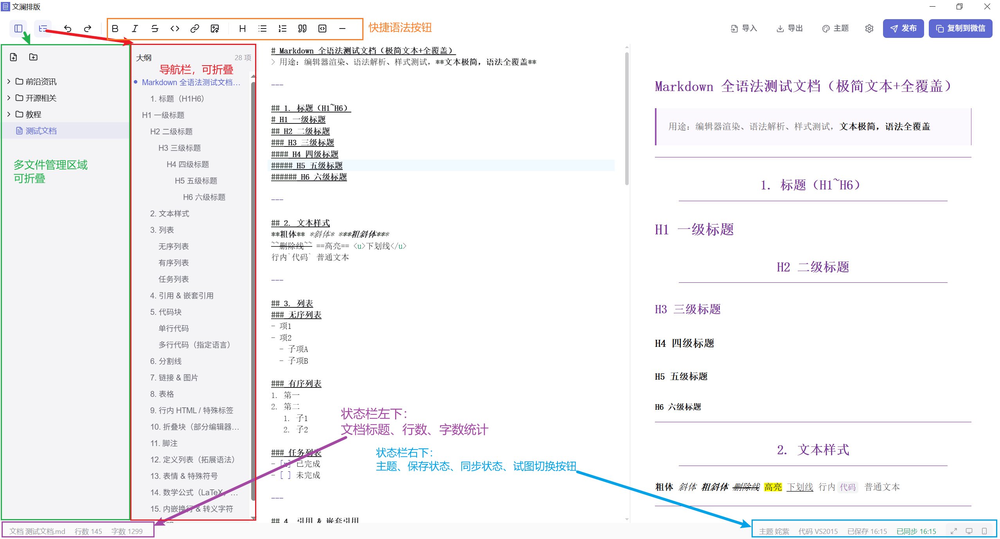
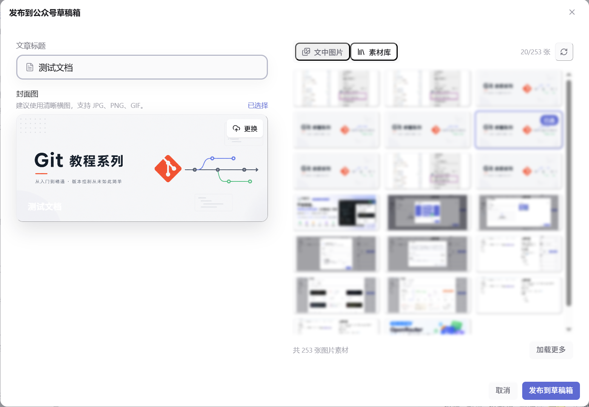
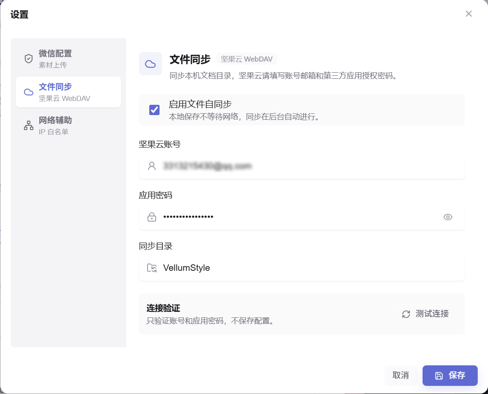

# 文澜排版 VellumStyle

本地优先的 Markdown 到微信公众号排版桌面工具。它把 Markdown 写作、公众号样式预览、微信兼容富文本复制、草稿箱发布、微信官方素材库上传、多文档管理、主题调整和文件云同步能力集成于一体，遂得此应用。



## 为什么做它

微信公众号写作常见的痛点不是 Markdown 本身，而是最后一步：样式要能粘贴进微信编辑器，图片要稳定，封面和正文素材要进入微信官方素材库，长文还要能导出和归档。

文澜排版希望把这条链路做成一个本地应用：文章留在本机，凭证留在本机，最后生成微信编辑器能识别的 HTML，或者直接写入公众号草稿箱。

## 核心能力

- **实时编辑与预览**：左侧 CodeMirror 编辑 Markdown，右侧实时渲染公众号文章效果。

- **复制到微信**与**直接发布到草稿箱**：把预览 DOM 转成微信编辑器友好的 `text/html`，并用 `juice` 内联 CSS，复制到剪贴板后可以直接在微信公众号官方编辑页粘贴即可恢复样式；上传封面图，校验正文图片，调用微信公众号草稿箱接口生成草稿放到微信公众号平台的草稿箱，非常方便。

  

- **微信官方素材库**：应用编辑文档时候上传的图片，均使用微信公众号永久素材库作为图床（微信官方图床）上传，直接避免了使用第三方图床带来的图床跑路，图片链接失效毁掉文章的风险。

- **多文档管理**与**文件同步**：应用数据目录中维护真实 `.md` 文件树，支持新建、重命名、删除、移动和自动保存等功能；同时，为了满足多设备使用，应用使用坚果云免费的 WebDAV服务，把本机 `documents/` 下的 Markdown 文档同步到云端目录。

  

- **主题系统**：内置 40+ 排版主题和 250+ Highlight.js/Base16 代码主题，支持搜索、分页、收藏和置顶。

  

- **导出**：支持 PNG 长图、独立 HTML、A4 PDF、Markdown 原文。

- **增强 Markdown**：支持 Mermaid、MathJax、`==高亮==`、链接脚注、`[toc]`、ruby 注音、图片尺寸语法等。

## 适合谁

- 经常用 Markdown 写公众号文章的人。
- 需要把文章图片上传到微信官方素材库的公众号运营者。
- 想要本地保存文章、主题和凭证，不依赖在线排版服务的人。
- 想研究 Markdown 到微信富文本转换、Tauri 桌面化、公众号草稿箱发布链路的开发者。

## 不适合谁

- 只需要一个在线 Markdown 预览器。
- 不使用微信公众号编辑器，也不需要微信素材库或草稿箱能力。
- 需要多人协同、云端账号体系、在线审批流的团队型 CMS。

## 下载与安装

如果仓库已经发布正式版本，优先从 GitHub Releases 下载系统对应安装包。

当前 Tauri 配置主要面向 Windows：

| 平台 | 当前状态 |
| --- | --- |
| Windows | 已配置 `msi` 和 `nsis` 打包目标 |
| macOS | 可按 Tauri v2 依赖自行构建，尚未提供发布包说明 |
| Linux | 可按 Tauri v2 依赖自行构建，尚未提供发布包说明 |

本地构建安装包：

```bash
npm install
npm run build
npx tauri build
```

构建产物通常位于：

```text
src-tauri/target/release/bundle/
```

## 第一次使用

1. 打开应用，新建或导入一篇 Markdown 文档。
2. 在左侧编辑，右侧预览公众号样式。
3. 打开「主题」选择排版主题，必要时在样式面板中微调。
4. 如果只想手动粘贴，点击「复制到微信」，再粘贴到公众号编辑器。
5. 如果要上传图片或发布草稿，打开「设置」填写微信公众号 AppID / AppSecret。
6. 在公众号后台把当前机器出口 IP 加入接口 IP 白名单。应用的「网络辅助」页可以获取并复制当前出口 IPv4。
7. 点击「发布」上传封面图并写入公众号草稿箱。

微信接口相关能力需要满足公众号平台要求。通常需要已认证公众号、可用的 AppID / AppSecret，以及正确的 IP 白名单。

更加详细的配置见[VellumStyle-文澜排版帮助文档](https://my.feishu.cn/docx/RUDpd1zWnoWuuyx0uFxcahIGnmC)

## 本地开发

### 环境要求

- Node.js 20 或更高版本。
- npm 10 或更高版本。
- Rust 1.77.2 或更高版本。
- Windows 桌面构建需要 WebView2 Runtime 和 Microsoft C++ Build Tools。
- macOS / Linux 请先安装 Tauri v2 对应系统依赖。

### 安装依赖

```bash
npm install
```

### 启动 Web 开发模式

```bash
npm run dev
```

默认端口是 `5173`。Web 模式适合调试编辑器、预览、主题、复制和纯前端逻辑；它没有真实 Tauri 后端，因此文件选择器、微信上传、草稿箱发布、PDF 直出、本地文档树、mmbiz 图片代理和坚果云同步不可用。

### 启动桌面开发模式

```bash
npm run tauri
# 或
npx tauri dev
```

桌面模式会先启动 Vite，再打开 Tauri 窗口。完整功能请优先在这个模式下验证。

### 基础检查

```bash
npx tsc -b --noEmit
npm test
npm run build
cargo test --manifest-path src-tauri/Cargo.toml
```

## 常用命令

| 命令 | 说明 |
| --- | --- |
| `npm run dev` | 启动 Vite Web 开发服务器 |
| `npm run tauri` | 启动完整 Tauri 桌面开发环境 |
| `npm run build` | TypeScript 项目构建检查 + Vite 生产构建 |
| `npm run preview` | 预览 `dist/` 产物 |
| `npm test` | 运行前端测试 |
| `npm run generate:code-themes` | 重新生成 Highlight.js 代码主题集合 |
| `npx tsc -b --noEmit` | 只做 TypeScript 类型检查 |
| `cargo check --manifest-path src-tauri/Cargo.toml` | Rust 快速检查 |
| `cargo test --manifest-path src-tauri/Cargo.toml` | Rust 测试 |
| `npx tauri build` | 构建桌面安装包 |

## 技术栈

| 层级 | 技术 |
| --- | --- |
| 前端框架 | React 18 + TypeScript |
| 构建工具 | Vite 6 |
| 桌面运行时 | Tauri v2 |
| 后端能力 | Rust + Tauri Commands |
| 编辑器 | CodeMirror 6 / `@uiw/react-codemirror` |
| 状态管理 | Zustand + persist |
| 样式 | Tailwind CSS 3，禁用 preflight 以避免污染预览区 |
| Markdown | markdown-it + 自定义插件链 |
| 数学公式 | MathJax 3 |
| 图表渲染 | Mermaid 11 |
| 代码高亮 | highlight.js 主题生成与作用域化 |
| CSS 内联 | juice |
| HTML 清洗 | DOMPurify |
| 动效与图标 | framer-motion + lucide-react |
| 测试 | Node.js test runner + tsx + jsdom，Rust `cargo test` |

## 项目结构

```text
.
├── src/
│   ├── App.tsx                    # 应用主布局与启动流程
│   ├── main.tsx                   # React 入口
│   ├── components/                # 编辑器、预览、主题、设置、发布等 UI
│   ├── markdown/                  # markdown-it、清洗、复制/发布转换、Mermaid/MathJax
│   ├── store/                     # Zustand 状态、自动保存、主题与同步状态
│   ├── themes/                    # 主题模型、编译器和内置主题
│   └── utils/                     # 文档、上传、导出、同步滚动、发布等工具
├── src-tauri/
│   ├── Cargo.toml                 # Rust crate 配置
│   ├── tauri.conf.json            # Tauri 窗口、CSP、打包配置
│   ├── capabilities/default.json  # Tauri 权限配置
│   └── src/                       # Rust 命令、文档树、微信接口、同步、导出
├── scripts/                       # 主题生成和维护脚本
├── docs/                          # 设计记录、实现计划和代码阅读说明
├── assets/readme/                 # README 截图
├── package.json
├── vite.config.ts
└── README.md
```

## 架构概览

### Markdown 渲染链路

```text
Markdown 文本
  -> markdown-it parser
  -> 自定义插件链
  -> DOMPurify 清洗
  -> mmbiz 图片代理改写
  -> Preview DOM
  -> MathJax 排版 / Mermaid SVG 渲染
```

### 复制到微信链路

```text
Preview DOM
  -> 等待 MathJax idle
  -> 读取文章 HTML
  -> 还原 wximg 代理图片链接
  -> 删除编辑辅助属性
  -> Mermaid SVG 兼容处理
  -> juice 内联主题 CSS
  -> 写入 ClipboardItem(text/html)
```

微信编辑器主要识别内联样式，因此复制前会尽量把主题 CSS 转成元素上的 `style=""`。

### Tauri 后端职责

Rust 侧负责所有需要本机能力或敏感凭证的部分：

- 读取和保存微信凭证。
- 选择 Markdown 文件、图片文件和资源目录。
- 维护 `documents/` 文档树。
- 写入导出文件，并在 Windows 上通过 WebView2 生成 A4 PDF。
- 通过坚果云 WebDAV 同步 Markdown 文档。
- 维护用户主题目录。
- 代理上传图片到微信素材库。
- 代理发布到微信公众号草稿箱。
- 注册 `wximg` 自定义协议，用于预览 mmbiz 图片。

## 数据存储

| 数据 | 存储位置 | 说明 |
| --- | --- | --- |
| Markdown 文档 | Tauri `app_data_dir/documents/` | 真实文件树，`.md` 文件即文档 |
| 微信凭证 | Tauri `app_data_dir/config.local.yaml` | 由设置页写入，不提交仓库 |
| 同步配置 | Tauri `app_data_dir/config.local.yaml` | 坚果云账号、应用授权密码和远端目录 |
| 本机同步状态 | Tauri `app_data_dir/sync-state.json` | 用于判断文件改动和删除 |
| 云端同步索引 | 坚果云 WebDAV 目录 `.vellumstyle-sync.json` | 用于多设备同步 |
| 用户主题 | Tauri `app_data_dir/themes/*.json` | 可在应用内打开主题文件夹 |
| 当前打开文档和主题偏好 | localStorage `vellumstyle` | Zustand persist，只存轻量 UI 偏好 |

## 测试

前端测试：

```bash
npm test
```

测试入口使用 Node.js 内置 test runner：

```json
"test": "node --import tsx --import ./src/test/setupDom.ts --test \"src/**/*.test.ts\""
```

Rust 测试：

```bash
cargo test --manifest-path src-tauri/Cargo.toml
```

构建检查：

```bash
npm run build
```

## 常见问题

### Web 模式提示 Tauri 命令不可用

这是正常现象。Web 模式只适合调试前端。以下能力必须使用桌面模式：

- 原生文件选择器。
- 微信图床上传。
- 公众号草稿箱发布。
- 本地文档真实文件树。
- 干净 A4 PDF 直接导出。
- 坚果云 WebDAV 文件同步。
- 用户主题目录。
- mmbiz 图片代理协议。

### 复制到微信后样式和预览不完全一致

公众号编辑器会改写部分标签、样式和外链资源。项目会尽量生成兼容 HTML，但正式发布前仍建议在微信后台预览确认。

### 上传提示尚未配置微信图床

打开「设置」填写并保存 AppID / AppSecret。凭证会保存在本机应用数据目录的 `config.local.yaml`，不会写入仓库。

### 获取 access_token 失败

常见原因是 AppID / AppSecret 填错、公众号接口权限不足、当前出口 IP 未加入白名单，或微信接口临时失败。

### mmbiz 图片预览不出来

mmbiz 预览依赖 Tauri `wximg` 自定义协议。请确认正在使用桌面模式，并且图片域名是 `mmbiz.qpic.cn` 或 `mmbiz.qlogo.cn`。

### 文件同步冲突

如果本地和云端同时修改同一个文档，应用会保留本地文件，并把云端版本保存为带 `坚果云冲突` 后缀的副本。处理方式是打开冲突副本，对比合并后删除多余文件。

## 贡献

欢迎提交 issue、复现步骤、主题样式、文档改进和小范围 PR。提交问题时请尽量包含：

- 操作系统和版本。
- 使用的是 Web 模式还是桌面模式。
- 复现步骤和预期结果。
- 控制台报错、截图或相关 Markdown 片段。
- 是否涉及微信素材库、草稿箱、坚果云同步等外部服务。

涉及微信凭证、AppSecret、坚果云授权密码、未发布文章内容的日志或截图，请先脱敏。

## 安全与边界

- 微信凭证只应保存在本机应用数据目录，不应提交到仓库。
- 坚果云账号和应用授权密码同样只保存在本机，不要把网页登录密码当作 WebDAV 授权密码使用。
- 文件同步会把 Markdown 文档内容写入用户配置的坚果云目录，涉及敏感内容时请谨慎启用。
- 远程图片下载会做公网地址限制，但后续支持更多媒体类型时仍需要持续检查大小、MIME、重定向和内网地址。
- 发布功能只写入草稿箱，不会自动群发。

## License

[MIT](./LICENSE) © pengcaiping

## 致谢与免责声明

本项目的产品逻辑、渲染管线和排版思路参考了 mdnice 的开源项目 [markdown-nice](https://github.com/mdnice/markdown-nice)，并基于 MIT License 做了学习和重写，特此致谢。

`src/themes/presets/` 中部分主题样式参考自 mdnice 在线服务，并非全部来自其开源仓库。该部分保留在项目中主要用于学习、个人使用和技术验证，不构成对第三方版权归属的主张。

如果你认为本仓库中的任何内容侵犯了你的版权或其他合法权益，请提供权利证明、作品链接和需要处理的文件范围。维护者会在核实后及时删除、替换或调整相关内容。
