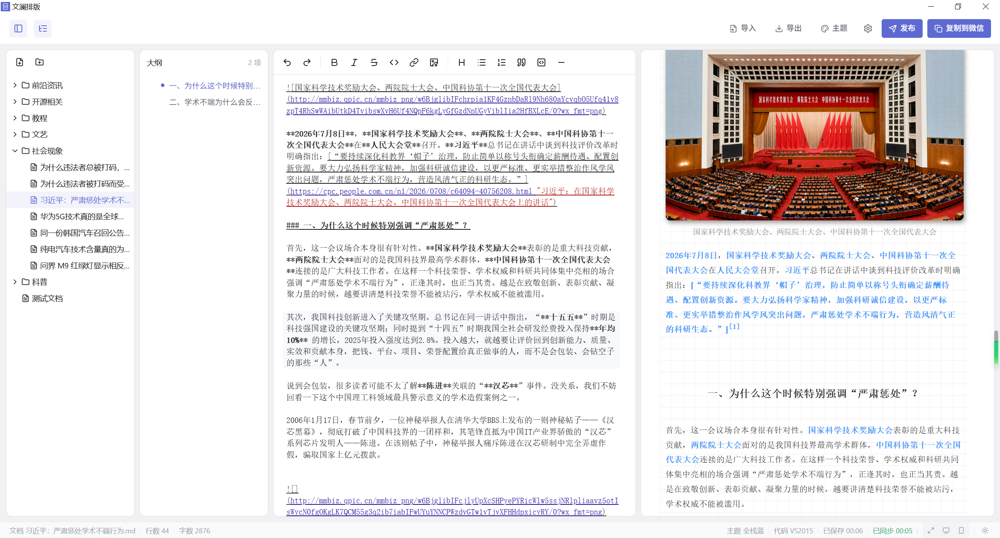
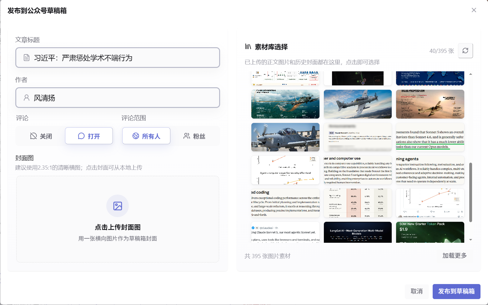
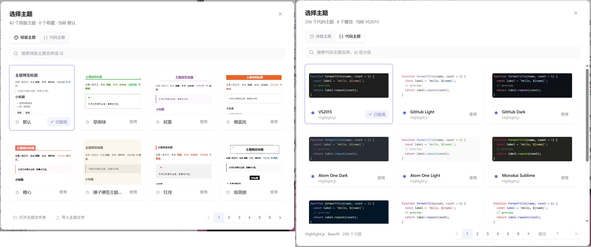

# 文澜排版 VellumStyle

<p align="center">
  <a href="#一软件覆盖的功能跟随提交实时更新">功能介绍</a>
  ·
  <a href="#二下载与安装">下载与安装</a>
  ·
  <a href="#三开源贡献与二次开发">参与开发</a>
  ·
  <a href="#四star-history">Star 趋势</a>
  ·
  <a href="#五license">开源许可</a>
  ·
  <a href="#六致谢与免责声明">致谢与声明</a>
</p>

本项目是用rust+tauri构建的桌面微信公众号排版工具。本工具排版仅适用于Markdown成稿的稿件，因此使用本软件的朋友一般需要具备一定的Markdown语法基础。当然，道友能看到本文，相信你已经来到了Github，故不会Markdown是我多虑了。




## 一、软件覆盖的功能（跟随提交实时更新）

1. 基本功能：

   实时编辑与预览，左侧编辑Markdown，右侧根据**选定的主题**实时渲染排版效果。编辑器支持部分常用Markdown语法占位符的快速插入，不过目前只能手动触发，还没有设置快捷键。

   编辑器和预览器实现了双向高精度同步滚动。

2. ⭐”发布“功能⭐：

   - 复制到微信：软件将渲染后的html代码写入剪贴板，使得用户在公众号网页端文章编辑区粘贴后能够保留在软件内看到的样式效果。

   - 发布到草稿箱：用户可以直接在软件内，上传封面图，填写标题、作者，调整评论功能后，调用微信公众号草稿箱接口生成将文章放到微信公众号平台的草稿箱，非常方便。

     封面图片可以用两种方式确定：①从本地上传，图片会上传到公众号永久素材库，然后返回mediaID；②直接用自己公众号永久素材库选择，如果需要用你已经上传过的图片，那么这一种方式将会非常方便。

     

3. ⭐图片上传使用微信官方图床⭐：

   软件目前支持三种图片处理方式，①Ctrl+V粘贴；②通过快捷语法按钮上传本地图片；③导入Markdown文档时，自动解析并处理原始图片。不管是哪一种，最终图片都会经软件调用软件后端上传服务，上传到自己公众号的永久素材库。

   图片上传后，文章图片的地址会被替换为微信永久素材库的官方链接。此般，解决了图床跑路导致文章图片失效的问题。

4. ⭐文章管理与云同步⭐：

   - 文章管理：在本地用户目录，针对本软件会创建一个目录用于存档我们写过的文章。如下图左图所示，文章是树形管理的，也就是说你可以像在使用windows文件管理一样在软件内创建文件夹或者Markdown文件。此外，所有文章，文件夹可以拖动管理，方便快速分类整理。

        

   - 云同步：为了满足多设备使用，软件使用坚果云免费的 WebDAV服务，把文件管理目录下的文件树同步到云端目录。在B设备上安装本软件后，配置好坚果云账号信息，即可恢复A设备的所有文章。

5. ⭐主题系统⭐：

   软件内置 40+ 排版主题和 250+ Highlight.js/Base16 代码主题，支持搜索、分页、收藏和置顶。

   

6. 其他”也许“对你来说实用的小功能：

   - Markdown文档导入：该功能区别于其他的编辑器逻辑——只上传文本，不做后处理，本软件上传过程中会单独处理所有的图片语法，不论你使用的是obisidian的"**![[]]**"语法，还是``的html标签语法，最终都会在图片上传后统一到``这样的Markdown图片插入标准语法。

     软件为了保留文档在其他编辑器编辑时留下的图片缩放等额外参数，对标准语法进行了轻度扩展，原始缩放会转换到``语法。

   - 扩展语法解析支持：①支持Mermaid代码直接渲染为SVG图形，并确保粘贴/发布到草稿箱后能保留SVG图形；②支持标准的 `$行内公式$`和`$$行间公式$$`数学公式渲染；③支持”参考文献“功能，文章如果使用了 `[xxx](url "title")`超链接语法，渲染为 $\lceil \text{xxx}\rfloor ^{[\text{文献序号}]}$这种样式，并自动在文末插入一条 $[\text{文献序号}]\space \text{title：url}$​​这样的文献。

   - 大纲导航：文档如果有标题语法，即 `# xxx`、 `## xxx`这种，左侧有可折叠导航栏，展开后可依据多级标题形成目录导航，方便长文定位。

   - 文档导出：支持 PNG 长图、独立 HTML、A4 PDF、Markdown 原文导出。虽然但是，感觉这个功能没啥用。

## 二、下载与安装

仓库已经发布了正式版本，第一次需要从 [GitHub Releases](https://github.com/CaipingPeng/VellumStyle/releases/latest) 下载系统对应的安装包。

当前 Tauri 配置主要面向 Windows：

| 平台 | 当前状态 |
| --- | --- |
| Windows | 已配置 `msi` 和 `nsis` 打包目标 |
| macOS | 作者没有环境，故尚未构建，期待你来贡献 |
| Linux | 尚未构建 |

软件安装后，详细的配置见[VellumStyle-文澜排版帮助文档](https://my.feishu.cn/docx/RUDpd1zWnoWuuyx0uFxcahIGnmC)

## 三、开源贡献与二次开发

>  欢迎提交 Issue、主题样式、文档改进和 PR。

环境要求：

- Node.js 20 或更高版本
- npm 10 或更高版本
- Rust 1.77.2 或更高版本
- Windows 桌面构建需要 WebView2 Runtime 和 Microsoft C++ Build Tools
- macOS / Linux 需要安装 [Tauri v2 对应的系统依赖](https://v2.tauri.app/start/prerequisites/)

安装依赖并启动完整桌面开发环境：

```bash
npm install
npm run tauri
```

如果只调试编辑器、预览和主题等前端功能，可以运行：

```bash
npm run dev
```

Web 模式不包含 Tauri 后端，因此文件选择、图片上传、草稿箱发布、本地文档树、PDF 导出和坚果云同步等功能不可用。

提交前请完成基础检查：

```bash
npm test
npm run build
cargo test --manifest-path src-tauri/Cargo.toml
```

提交问题时请说明操作系统、复现步骤、预期结果和相关报错。日志或截图中的 AppSecret、坚果云授权密码及未发布文章内容请先脱敏。

## 四、Star History

<p align="center">
  <a href="https://star-history.com/#CaipingPeng/VellumStyle&Date">
    
  </a>
</p>

## 五、License

[MIT](./LICENSE) © pengcaiping

## 六、致谢与免责声明

本项目的产品逻辑、渲染管线和排版思路参考了 mdnice 的开源项目 [markdown-nice](https://github.com/mdnice/markdown-nice)，并基于 MIT License 做了学习和重写，特此致谢。

`src/themes/presets/` 中部分主题样式参考自 mdnice 在线服务，并非全部来自其开源仓库。该部分保留在项目中主要用于学习、个人使用和技术验证，不构成对第三方版权归属的主张。

此外，本项目的完成，离不开 LinuxDO 社区的支持，本开源项目已链接并认可 [LINUX DO 社区](https://linux.do/)。

如果你认为本仓库中的任何内容侵犯了你的版权或其他合法权益，请提供权利证明、作品链接和需要处理的文件范围。维护者会在核实后及时删除、替换或调整相关内容。
