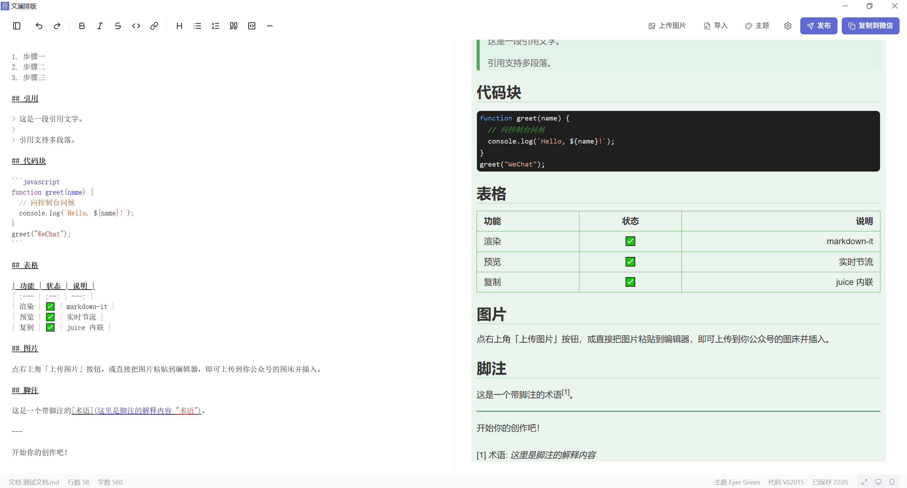

# 文澜排版 VellumStyle



文澜排版是一个本地优先的 Markdown 到微信公众号排版桌面工具。它把 Markdown 写作、公众号样式预览、微信兼容富文本复制、图片上传到微信官方素材库、发布到公众号草稿箱、多文档管理和可视化主题调整放在同一个 Tauri 桌面应用里。

项目的核心思路来自 mdnice/markdown-nice 的排版工作流，但实现已经重写为 React + TypeScript + Tauri v2，并补上了本地文件、微信官方图床、草稿箱发布和结构化主题模型。

# 目录

- [核心功能](#核心功能)
- [软件使用](#软件使用)
- [文件同步](#文件同步)
- [技术栈](#技术栈)
- [运行环境](#运行环境)
- [二次开发](#二次开发)
  - [快速开始](#快速开始)
  - [项目结构](#项目结构)
- [系统架构](#系统架构)
- [数据与配置存储](#数据与配置存储)
- [主题系统](#主题系统)
- [Markdown 渲染能力](#markdown-渲染能力)
- [常用脚本](#常用脚本)
- [测试与质量检查](#测试与质量检查)
- [桌面端打包](#桌面端打包)
- [可选维护脚本](#可选维护脚本)
- [故障排查](#故障排查)
- [发布与安全注意事项](#发布与安全注意事项)
- [License](#license)
- [致谢与免责声明](#致谢与免责声明)

# 核心功能

- **Markdown 编辑与实时预览**：左侧使用 CodeMirror 6 编辑，右侧支持实时渲染移动端、web端公众号文章样式。
- **Mermaid 图表渲染**：支持 `mermaid` 围栏代码块在预览区直接渲染为流程图等 SVG 图表；复制到微信或发布到草稿箱时保留 SVG 结构和可复制文本，不会转成 PNG 图片占用公众号素材库。
- **微信官方图床**：通过 Tauri Rust 命令代理调用微信公众号永久素材接口，上传成功后获得 `mmbiz.qpic.cn` 链接。这样做规避了mdnice等工具使用第三方图床，带来图床跑路，文章作废的风险。
- **Markdown 文章导入**：选择外部 `.md` / `.markdown` 文件，可以将文章导入，并自动扫描文章中远程图片链接，下载并上传到微信素材库并替换链接；对于本地图片链接，可以自动扫描附件目录，并上传到微信素材库并替换链接。
- **mmbiz 图片预览代理**：预览时如果不使用代理，永久素材库的图片链接将无法显示（微信会验证图片是不是在微信域名打开的）。因此本工具使用 Tauri 自定义 `wximg` 协议带微信 Referer 拉图，复制前自动还原为原始 mmbiz 链接。
- **发布到公众号草稿箱**：上传封面图，校验正文图片均已进入微信素材域，再调用 `draft/add` 写入公众号草稿箱。支持从正文已上传图片中选择封面，也可直接从公众号永久素材库中选择已有图片作为封面，避免重复上传生成冗余素材。
- **文章导出**：工具栏「导出」支持 PNG 长图、HTML 和 A4 PDF。PDF 由 Tauri/WebView2 直接生成，不走系统打印窗口，不携带浏览器页眉页脚，正文文本可选中，并会根据文章标题生成 PDF 大纲/书签。
- **复制到微信**：如果不想上传到草稿箱，也可以在浏览器打开公众号文章编辑页面，然后点击“复制”，把预览 DOM 转成微信编辑器可识别的 `text/html`，并用 `juice` 将 CSS 内联到元素 `style`。粘贴到编辑页面后将保留在工具中渲染出来的样式。
- **主题选择与收藏**：内置 41 款排版主题和 250+ Highlight.js/Base16 代码主题，支持搜索、分页、收藏和置顶。
- **结构化主题模型**：主题不是裸 CSS，而是 `StyleModel`；运行时编译成 CSS，预览元素可点击后在样式面板中调整。
- **多文档管理**：应用数据目录下维护真实 `documents/` 文件树，支持新建、重命名、删除、移动和自动保存。
- **坚果云文件同步**：可在设置页启用坚果云 WebDAV 同步，把本机 `documents/` 下的 Markdown 文档同步到云端目录；状态栏会在“已保存”旁边显示同步状态。
- **IP 白名单辅助**：从设置页一键获取当前出口 IPv4 地址并复制到剪贴板，方便添加到公众号后台白名单。
- **同步滚动**：Markdown 顶层块带 `data-line` 行号，编辑器与预览区按源码行双向同步。
- **文档大纲导航**：自动解析 Markdown 文档中的标题层级，生成可导航的大纲侧栏。点击大纲项可跳转到对应章节，预览滚动时大纲高亮自动跟随。
- **本地优先**：文档、主题和微信凭证都保存在本机 Tauri 应用数据目录中，不依赖远端服务器。

# 软件使用

相关问题，见[VellumStyle-文澜排版帮助文档](https://my.feishu.cn/docx/RUDpd1zWnoWuuyx0uFxcahIGnmC)

# 文件同步

文件同步目前支持坚果云 WebDAV。它是本地优先的同步能力：应用数据目录中的 `documents/` 仍然是真实文档源，坚果云只作为多设备之间交换 Markdown 文档的远端存储。后续如果接入其他 WebDAV 或云盘接口，也会沿用同一套配置和同步状态模型。

## 启用坚果云同步

1. 打开应用右上角「设置」。
2. 在左侧导航切到「文件同步」。
3. 打开「启用文件同步」。
4. 填写坚果云账号邮箱。
5. 填写坚果云“第三方应用管理”中生成的应用授权密码，不要填写坚果云网页登录密码。
6. 确认云端目录，默认是 `VellumStyle`。应用会把同步索引和文档写入这个目录。
7. 点击「测试连接」确认账号和授权密码可用。
8. 点击「保存设置」后，同步会在应用启动、文档保存、文档树新建/重命名/删除/移动后自动触发。

「测试连接」只做只读 WebDAV `PROPFIND` 校验，用来确认坚果云账号和应用授权密码是否正确；它不会保存设置，也不会创建远端目录。真正启用后，应用会按需创建云端目录和子目录。

## 同步状态

状态栏会在保存状态旁边显示文件同步状态：

| 状态 | 含义 |
| --- | --- |
| `同步关闭` | 未启用同步，或 Web 调试模式下不可用 |
| `待同步` | 已启用但尚未完成一次同步 |
| `同步中` | 正在和坚果云交换文档 |
| `已同步 HH:mm` | 最近一次同步成功 |
| `同步冲突` | 同步完成，但检测到本地和云端都有改动 |
| `同步失败` | 网络、账号、授权密码或 WebDAV 服务返回错误 |

鼠标悬停在状态文本上可以看到最近一次同步返回的详细消息。

## 冲突与数据边界

- 当前只同步 `documents/` 下的 `.md` 文档，不同步微信凭证、主题、localStorage UI 偏好和构建产物。
- 如果本地和云端同时修改同一个文档，应用保留本地文件作为主版本，并把云端版本保存成同目录下的冲突副本，例如 `周报 (坚果云冲突 20260614-090800).md`。
- 同步索引会写入云端目录的 `.vellumstyle-sync.json`，本机同步状态会写入 Tauri 应用数据目录下的 `sync-state.json`。这两个文件用于判断上传、下载、删除和冲突。
- 更换坚果云账号或云端目录会形成新的同步作用域；应用会重新建立对应目录下的同步索引。

# 技术栈

| 层级 | 技术 |
| --- | --- |
| 前端框架 | React 18 + TypeScript |
| 构建工具 | Vite 6 |
| 桌面运行时 | Tauri v2 |
| 后端能力 | Rust 1.77.2 + Tauri Commands |
| 编辑器 | CodeMirror 6 / `@uiw/react-codemirror` |
| 状态管理 | Zustand + persist |
| 样式 | Tailwind CSS 3，禁用 preflight 以避免污染预览区 |
| Markdown | markdown-it + 自定义插件链 |
| 数学公式 | MathJax 3 |
| 图表渲染 | Mermaid 11 |
| 代码高亮 | highlight.js 主题生成与作用域化 |
| CSS 内联 | juice |
| HTML 清洗 | DOMPurify |
| 动效与图标 | framer-motion + lucide-react |
| 配置格式 | YAML / JSON |
| 测试 | Node.js test runner + tsx + jsdom，Rust `cargo test` |

# 运行环境

本项目可以以两种模式运行：

| 模式 | 命令 | 能力范围 |
| --- | --- | --- |
| Web 开发模式 | `npm run dev` 或 `npx vite` | 编辑、预览、主题、复制、HTML 导出等纯前端能力；Tauri 命令不可用，文件树使用内存 fallback |
| 桌面开发模式 | `npm run tauri dev` 或 `npx tauri dev` | 完整能力：本地文件、微信图床、导入、PNG/PDF/HTML 导出、主题目录、草稿箱发布、mmbiz 代理 |

推荐开发环境：

- Node.js 20 或更高版本。
- npm 10 或更高版本。
- Rust 1.77.2 或更高版本。
- Windows 桌面构建需要 WebView2 Runtime 和 Microsoft C++ Build Tools。
- macOS / Linux 构建请按 Tauri v2 官方前置依赖安装系统库。
- 使用微信图床或草稿箱发布时，需要一个已认证的微信公众号服务号 AppID / AppSecret，并正确配置 IP 白名单。

# 二次开发

## 快速开始

### 1. 安装依赖

```bash
npm install
```

### 2. 启动 Web 开发模式

```bash
npm run dev
# 或
npx vite
```

默认端口是 `5173`，并且 Vite 配置了 `strictPort: true`。如果端口被占用，需要先关闭占用进程，或临时修改 `vite.config.ts` 中的端口。

Web 模式适合调试前端 UI、Markdown 渲染、主题和复制逻辑。它没有真实 Tauri 后端，因此微信图床、文件选择器、本地文档目录、草稿箱发布等桌面能力不可用。

### 3. 启动桌面开发模式

```bash
npm run tauri dev
# 或
npx tauri dev
```

Tauri 会先执行 `npm run dev:web` 启动 Vite，再打开桌面窗口。完整功能请优先用这个模式验证。

### 4. 执行基础检查

```bash
npx tsc -b --noEmit
npm test
npm run build
cargo test --manifest-path src-tauri/Cargo.toml
```

`npm test` 覆盖前端纯逻辑与 DOM 逻辑；`cargo test` 覆盖 Rust 侧路径校验、主题选择器迁移、远程图片安全限制等逻辑。


## 项目结构

```text
.
├── src/
│   ├── App.tsx                       # 应用主布局与启动流程
│   ├── main.tsx                      # React 入口
│   ├── articleRoot.ts                # 预览文章根节点常量
│   ├── content.md                    # 首次启动示例内容
│   ├── components/
│   │   ├── Copy/                     # 复制到微信
│   │   ├── DocTree/                  # 多文档树与拖拽移动
│   │   ├── Editor/                   # CodeMirror 编辑器与语法编辑纯函数
│   │   ├── Export/                   # PNG 长图、HTML、A4 PDF 导出入口
│   │   ├── Import/                   # Markdown 导入弹窗
│   │   ├── Preview/                  # 公众号预览区与预览宽度模式
│   │   ├── Publish/                  # 发布到公众号草稿箱
│   │   ├── Settings/                 # 微信凭证、文件同步、网络辅助设置
│   │   ├── StylePanel/               # 可视化样式面板
│   │   ├── Theme/                    # 主题选择、缩略图和主题导入
│   │   ├── Toast/                    # 轻量 toast
│   │   ├── Toolbar/                  # 主工具栏与语法工具栏
│   │   ├── Upload/                   # 图片上传入口
│   │   └── ui/                       # Button/Dialog/Menu/IconButton 等基础 UI
│   ├── markdown/
│   │   ├── parser.ts                 # markdown-it 实例与插件链
│   │   ├── converter.ts              # 复制/发布用 HTML 生成与规范化
│   │   ├── sanitize.ts               # DOMPurify 清洗
│   │   ├── mathjax.ts                # MathJax 排版等待与触发
│   │   ├── mermaid.ts                # Mermaid 围栏代码块的浏览器端 SVG 渲染
│   │   ├── mermaidExport.ts          # 复制/发布前内联 Mermaid SVG 样式并转原生 SVG 文本
│   │   ├── codeThemes.ts             # 代码主题作用域化与合并
│   │   ├── generatedHljsThemes.ts    # 生成的代码主题集合
│   │   └── plugins/                  # 自定义 markdown-it 插件
│   ├── store/
│   │   └── index.ts                  # Zustand 状态、自动保存、主题与同步状态
│   ├── styles/
│   │   └── globals.css               # 应用全局样式与滚动条样式
│   ├── test/
│   │   └── setupDom.ts               # Node test + jsdom 测试环境
│   ├── themes/
│   │   ├── default.json              # 默认排版主题模型
│   │   ├── index.ts                  # 内置主题加载
│   │   ├── compileModel.ts           # StyleModel -> CSS
│   │   ├── loader.ts                 # 内置主题 + 用户主题合并
│   │   ├── themeModel.ts             # 主题模型类型与校验
│   │   └── presets/                  # 内置排版主题 JSON
│   └── utils/
│       ├── autosave.ts               # debounce 自动保存
│       ├── cloudSync.ts              # 文件同步 Tauri command 封装与状态格式化
│       ├── clipboard.ts              # text/html 剪贴板写入
│       ├── documents.ts              # 前端文档树 Tauri command 封装
│       ├── exportArticle.ts          # PNG/HTML/PDF 导出渲染与保存流程
│       ├── imageProxy.ts             # mmbiz 预览代理链接转换
│       ├── markdownImport.ts         # 导入 Markdown 并上传替换媒体
│       ├── markdownMediaScanner.ts   # Markdown/HTML/Obsidian 媒体扫描
│       ├── publish.ts                # 发布前图片校验与草稿箱封装
│       ├── style.ts                  # 样式注入工具
│       ├── syncScroll.ts             # 编辑器与预览同步滚动
│       ├── tauriEnv.ts               # Tauri 运行环境识别
│       └── upload.ts                 # 图片上传封装
├── src-tauri/
│   ├── Cargo.toml                    # Rust crate 配置
│   ├── tauri.conf.json               # Tauri 窗口、CSP、打包配置
│   ├── capabilities/default.json     # Tauri 权限配置
│   └── src/
│       ├── lib.rs                    # Tauri Builder、commands、wximg 协议
│       ├── main.rs                   # 桌面入口
│       ├── config.rs                 # 配置读取与保存
│       ├── documents.rs              # 文档文件树
│       ├── export_file.rs            # 文件写入与 WebView2 PDF 导出
│       ├── import.rs                 # 文件选择与导入媒体解析
│       ├── sync.rs                   # 坚果云 WebDAV 文档同步
│       ├── themes.rs                 # 用户主题目录与导入
│       └── wechat.rs                 # 微信图床、草稿箱、图片代理
├── scripts/
│   ├── generate-hljs-themes.mjs      # 生成代码主题
│   └── crawl_mdnice_themes.py        # 抓取 mdnice 主题的维护脚本
├── docs/
│   ├── PROGRESS.md                   # 历史实现进度与决策记录
│   ├── learn/                        # 代码阅读说明
│   └── superpowers/                  # 设计与实现计划归档
├── logos/                            # 应用 Logo SVG 源图与生成脚本
│   └── vellumstyle/                   # Logo 源文件
├── config.yaml                       # 微信配置示例模板
├── package.json                      # 前端脚本与依赖
├── vite.config.ts                    # Vite 构建配置（含 chunk 分割策略）
├── tailwind.config.js                # Tailwind 配置
└── README.md
```

## 系统架构

### 前端启动流程

`src/App.tsx` 是应用的组织中心：

1. 加载内置主题与用户主题。
2. 加载文档树。
3. 如果是首次启动，创建示例文档；如果存在旧 localStorage 内容，则迁移为 `草稿.md`。
4. 打开上次使用的文档，或打开文档树中的第一篇文档。
5. 建立编辑器和预览区之间的同步滚动。
6. 在 Tauri 环境中监听窗口关闭，关闭前强制 flush 当前文档保存。

### Markdown 渲染流水线

```text
Markdown 文本
  -> markdown-it parser
  -> 自定义插件链
  -> DOMPurify 清洗
  -> mmbiz 图片代理改写
  -> Preview DOM
  -> MathJax 排版 / Mermaid SVG 渲染
```

插件链主要包括：

- 标题 span 装饰。
- 表格容器。
- 数学公式。
- `==mark==` 高亮。
- 链接脚注。
- `[toc]` 目录。
- Mermaid 围栏代码块。
- ruby 注音。
- figure / figcaption。
- 定义列表。
- 列表项 section 包裹。
- 横向图片流。
- 多级引用 class。
- 图片尺寸语法。
- 顶层块 `data-line` 注入。

### 复制流水线

```text
Preview DOM
  -> 等待 MathJax idle
  -> 读取 #article-box.innerHTML
  -> 还原 wximg 代理图片链接
  -> 删除 data-line 和编辑辅助 class
  -> MathJax 节点转微信友好结构
  -> Mermaid SVG 内联关键样式，并把 foreignObject 标签转为原生 SVG text
  -> juice.inlineContent(html, css)
  -> ClipboardItem(text/html)
```

微信编辑器主要识别内联样式，因此最终 HTML 需要尽量把主题 CSS 变成元素上的 `style=""`。
Mermaid 图表在复制和发布时走 SVG 兼容处理：从预览 DOM 读取真实渲染后的 SVG，内联节点、连线、箭头和文字的关键展示属性，移除不适合微信编辑器的 `style` 节点，并把可能残留的 `foreignObject` HTML 标签转成原生 SVG `<text>` / `<tspan>`。这样文本仍可选中复制，图表也不会被上传成图片素材。

### 导出流水线

```text
Preview DOM / solveHtml()
  -> 等待 MathJax idle
  -> 生成 A4 导出 HTML
  -> PNG: 克隆预览内容到 A4 宽度隐藏容器，再用 html2canvas 输出长图
  -> HTML: 写出独立 HTML 文件
  -> PDF: 隐藏 WebView2 加载导出 HTML，调用 Page.printToPDF 写入 A4 PDF
```

PDF 导出不调用系统打印窗口，因此不会带 URL、日期、页码等浏览器页眉页脚。标题节点会补充稳定锚点，并通过 Chromium `generateDocumentOutline` 生成 PDF 阅读器侧边栏大纲。非 Tauri Web 模式无法直接访问 WebView2 和本地保存对话框，PDF 导出会退化为下载可打印的 HTML。

### Tauri 与 Rust 后端

前端通过 `@tauri-apps/api/core` 的 `invoke` 调用 Rust 命令。Rust 侧负责所有需要本机能力或敏感凭证的功能：

- 读取和保存微信凭证。
- 选择 Markdown 文件、图片文件、资源目录。
- 维护 `documents/` 文档树。
- 写入导出文件，并在 Windows 上通过隐藏 WebView2 + Chrome DevTools `Page.printToPDF` 生成干净 A4 PDF。
- 通过坚果云 WebDAV 同步 `documents/` 下的 Markdown 文档。
- 维护 `themes/` 用户主题目录。
- 代理上传图片到微信素材库。
- 代理发布到微信公众号草稿箱。
- 下载远程图片并做格式、大小和公网地址校验。
- 注册 `wximg` 自定义协议，用于预览 mmbiz 图片。

`src-tauri/capabilities/default.json` 只授予主窗口核心能力、窗口 destroy 权限和 dialog 权限。新增 Tauri API 时需要同步检查权限。

### 文件同步流水线

```text
本地 documents/*.md
  -> 扫描相对路径和内容指纹
  -> 读取本机 sync-state.json
  -> 读取坚果云 .vellumstyle-sync.json
  -> 对比本地 / 云端 / 上次同步三方状态
  -> 上传、下载、删除或生成冲突副本
  -> 写回本机和云端同步索引
  -> 更新状态栏同步状态
```

同步入口是 Rust 命令 `sync_documents`，前端通过 `src/utils/cloudSync.ts` 调用。`App.tsx` 会在启动后触发一次同步，文档保存或文档树发生变化后也会触发后台同步。连接测试入口是 `test_sync_connection`，它只使用只读 `PROPFIND` 校验坚果云 WebDAV 凭证。

### mmbiz 图片代理

微信素材图片有 Referer 防盗链。浏览器/WebView 不能随意伪造 Referer，因此预览直接请求 mmbiz 链接可能显示失败。

项目采用三段式处理：

1. Markdown 中永远保存原始 `mmbiz.qpic.cn` 或 `mmbiz.qlogo.cn` 链接。
2. 预览渲染时，`src/utils/imageProxy.ts` 把图片 `src` 改写为 `wximg` 自定义协议 URL。
3. Rust 的 `handle_wximg` 只允许微信图片白名单域名，带 `Referer: https://mp.weixin.qq.com` 拉图并返回给 WebView。
4. 复制到微信前，`fromProxyHtml` 再把代理 URL 还原为原始 mmbiz 链接。

这样不会污染 Markdown 源码，也不会把本地代理地址复制进公众号。

## 数据与配置存储

### 持久化分工

| 数据 | 存储位置 | 说明 |
| --- | --- | --- |
| Markdown 文档 | Tauri `app_data_dir/documents/` | 真实文件树，`.md` 文件即文档 |
| 微信凭证 | Tauri `app_data_dir/config.local.yaml` | 由设置页写入，不提交仓库 |
| 同步配置 | Tauri `app_data_dir/config.local.yaml` | `sync.enabled`、`provider`、坚果云账号、应用授权密码和远端目录 |
| 本机同步状态 | Tauri `app_data_dir/sync-state.json` | 记录上次同步的文件指纹，用于判断改动和删除 |
| 云端同步索引 | 坚果云 WebDAV 目录 `.vellumstyle-sync.json` | 记录云端文件指纹，用于多设备同步 |
| 用户主题 | Tauri `app_data_dir/themes/*.json` | 主题文件夹可在应用内打开 |
| 当前打开文档、主题偏好 | localStorage `vellumstyle` | Zustand persist，只存轻量 UI 偏好 |
| 构建产物 | `dist/`、`src-tauri/target/` | 已被 `.gitignore` 忽略 |

### 文档保存机制

- `setContent` 后通过 `createDebouncedSaver` 延迟 800ms 写盘。
- 切换文档前会 `await flushSave()`，避免旧文档未落盘。
- 关闭窗口前会阻止默认关闭，先 flush，再调用 `win.destroy()`。
- 保存失败会进入 `saveStatus: "error"` 并展示 toast。
- 同步启用后，保存成功会调度后台同步；同步失败不会阻止本地保存。

### 文件同步机制

- 同步服务只处理 `.md` 文件，保持文档树相对路径，不会上传应用配置、主题文件或构建产物。
- 首次同步时，如果云端目录没有索引，应用会创建 `.vellumstyle-sync.json` 并把本机文档作为初始状态上传。
- 后续同步会比较本机文件、云端索引和本机 `sync-state.json` 三方状态，区分新增、修改、删除和冲突。
- 同一个文件本地和云端都改过时，本地版本继续占用原文件名，云端版本会被保存为带 `坚果云冲突` 标记的副本。
- Web 开发模式没有 Tauri 后端，`runCloudSync()` 会返回“Web 调试模式未启用文件同步”，不会访问坚果云。

### 文档路径安全

Rust 侧 `documents.rs` 中所有文档路径都是相对 `documents/` 的路径。解析时会逐段拒绝 `.`、`..` 和绝对路径，并在可能时通过 `canonicalize` 做二次校验，避免路径逃逸。

## 主题系统

### 排版主题

排版主题的真相源是 `StyleModel[]`，不是 CSS 字符串。每个主题大致长这样：

```json
{
  "name": "主题名",
  "model": [
    {
      "id": "paragraph",
      "label": "段落",
      "styles": [
        {
          "id": "fontSize",
          "value": "16px",
          "keys": [{"selector": "#article p", "key": "font-size"}]
        }
      ]
    }
  ]
}
```

运行时由 `src/themes/compileModel.ts` 编译成 CSS。可视化样式面板修改的也是模型值，再重新编译。

### 内置主题

- `src/themes/default.json` 是默认 GitHub 风格主题。
- `src/themes/presets/*.json` 是内置预设主题。
- `src/themes/index.ts` 通过 `import.meta.glob` 异步加载预设主题，并按中文名排序。

新增内置主题时，把 `{name, model}` 结构的 JSON 放入 `src/themes/presets/` 即可。

### 用户主题

用户主题从 Tauri 应用数据目录的 `themes/*.json` 加载，支持两种形态：

```json
[
  {"id": "paragraph", "styles": []}
]
```

或：

```json
{
  "name": "我的主题",
  "model": [
    {"id": "paragraph", "styles": []}
  ]
}
```

### 代码主题

代码主题来自 Highlight.js/Base16。`scripts/generate-hljs-themes.mjs` 会生成 `src/markdown/generatedHljsThemes.ts`，再由 `src/markdown/codeThemes.ts` 将选择器作用域限制到：

```css
#article pre.custom
#article pre.custom code.hljs
```

这样代码主题不会影响应用 UI，也不会污染文章其他元素。

## Markdown 渲染能力

除了标准 Markdown，当前渲染管线还支持：

- HTML 片段输入，并在渲染后经过 DOMPurify 清洗。
- fenced code block 代码高亮。
- `mermaid` fenced code block 图表渲染，例如流程图、时序图、状态图等 Mermaid 支持的图表类型。
- 数学公式。
- `==高亮==`。
- 链接转脚注。
- `[toc]` 目录。
- ruby 注音语法。
- 定义列表。
- figure / figcaption。
- 图片尺寸语法，例如 ``。
- 横屏图片滑动容器。
- Obsidian 图片 embed 在导入流程中转换。

注意：公众号编辑器对部分复杂 CSS、脚本、交互和外链资源有自己的限制。项目会尽量生成兼容 HTML，但最终仍建议在公众号后台预览确认。

## 常用脚本

| 命令 | 说明 |
| --- | --- |
| `npm install` | 安装前端和 Tauri CLI 依赖 |
| `npm run dev` | 启动 Vite Web 开发服务器 |
| `npm run dev:web` | `npm run dev` 的别名，供 Tauri `beforeDevCommand` 使用 |
| `npm run tauri dev` | 启动完整 Tauri 桌面开发环境 |
| `npm run build` | TypeScript 项目构建检查 + Vite 生产构建 |
| `npm run preview` | 预览 `dist/` 产物 |
| `npm run tauri build` | 构建桌面安装包 |
| `npm test` | 运行前端测试 |
| `npm run generate:code-themes` | 重新生成 Highlight.js 代码主题集合 |
| `npm run generate:logos` | 根据 SVG 源图生成各尺寸 PNG 格式应用图标 |
| `npx tsc -b --noEmit` | 只做 TypeScript 类型检查 |
| `cargo check --manifest-path src-tauri/Cargo.toml` | Rust 快速检查 |
| `cargo test --manifest-path src-tauri/Cargo.toml` | Rust 测试 |

## 测试与质量检查

### 前端测试

```bash
npm test
```

测试入口使用 Node.js 内置 test runner：

```json
"test": "node --import tsx --import ./src/test/setupDom.ts --test \"src/**/*.test.ts\""
```

覆盖重点包括（26 个测试文件）：

- Tauri 环境识别。
- Web fallback 文档树。
- CSP nonce 读取。
- 自动保存 debounce 与 flush。
- 文件同步状态格式化与 Web 调试模式 fallback。
- Markdown 渲染、清洗和导出转换。
- Mermaid 预览渲染标记、微信导出 SVG 样式内联和 `foreignObject` 转原生 SVG 文本。
- PNG 长图、HTML 和 A4 PDF 导出文档生成。
- MathJax 导出后处理。
- 代码主题作用域化。
- 主题模型校验与编译。
- 默认主题视觉关键值。
- 编辑器语法插入纯函数。
- 预览宽度模式。
- 工具栏溢出计算。
- 样式面板控件和元素映射。
- 主题搜索、分页、收藏和置顶逻辑。
- 主题缩略图 CSS scope。
- 滚动条样式与 CodeMirror CSP nonce。
- 导入对话框流程。
- 出口 IP 监控。

### TypeScript 检查

```bash
npx tsc -b --noEmit
```

`tsconfig.json` 开启了 `strict`、`noUnusedLocals`、`noUnusedParameters`、`noFallthroughCasesInSwitch` 等检查。提交前建议总是跑一遍。

### Rust 检查

```bash
cargo check --manifest-path src-tauri/Cargo.toml
cargo test --manifest-path src-tauri/Cargo.toml
```

Rust 测试目前覆盖路径命名规则、主题选择器归一化、远程图片重定向安全限制、同步配置校验、WebDAV 状态分类和冲突副本命名等逻辑。

### 生产构建检查

```bash
npm run build
```

该命令会先执行 `tsc -b`，再执行 `vite build`。Tauri 打包前也会通过 `beforeBuildCommand` 调用它。

## 桌面端打包

```bash
npm run tauri build
# 或
npx tauri build
```

当前 `src-tauri/tauri.conf.json` 配置：

- 产品名：`VellumStyle`
- 窗口标题：`文澜排版`
- identifier：`com.vellumstyle.desktop`
- 开发 URL：`http://localhost:5173`
- 前端产物目录：`../dist`
- Windows 打包目标：`msi`、`nsis`
- 生产 CSP：限制默认来源，允许 mmbiz 图片代理、Tauri asset protocol、内联样式和 IPC 连接。

构建产物通常位于：

```text
src-tauri/target/release/bundle/
```

Windows 下会生成 `.msi` 和 NSIS 安装包。

## 故障排查

### `npm run dev` 端口被占用

Vite 配置了：

```ts
server: {
  port: 5173,
  strictPort: true,
}
```

如果端口被占用，Vite 不会自动换端口。关闭占用 `5173` 的进程后重试，或临时修改 `vite.config.ts`。

### Web 模式提示 Tauri 命令不可用

这是正常现象。Web 模式只适合调试前端。以下能力必须使用 `npm run tauri dev`或`npx tauri dev`：

- 原生文件选择器。
- 微信图床上传。
- 公众号草稿箱发布。
- 本地文档真实文件树。
- 干净 A4 PDF 直接导出。
- 坚果云 WebDAV 文件同步。
- 用户主题目录。
- mmbiz 图片代理协议。

### PDF 导出没有生成大纲或变成 HTML

干净 PDF 直接导出依赖 Tauri 桌面模式和 Windows WebView2 的 DevTools `Page.printToPDF` 能力。请确认：

- 正在使用 `npm run tauri dev` 或打包后的桌面应用，而不是纯 Web 模式。
- 文章中使用真实 Markdown 标题（`#`、`##` 等）生成 `h1` 到 `h6`，PDF 大纲会基于这些标题生成。
- Windows 已安装或更新 WebView2 Runtime。

纯 Web 模式下没有本地 WebView2 和文件保存命令，PDF 导出会退化为下载可打印 HTML，供浏览器或其他工具处理。

### 文件同步测试连接失败

先确认填写的是坚果云账号邮箱和“第三方应用管理”中生成的应用授权密码。坚果云网页登录密码不能用于 WebDAV。

如果仍然失败，继续检查：

- 当前网络是否能访问 `https://dav.jianguoyun.com/dav/`。
- 账号是否启用了坚果云 WebDAV / 第三方应用授权。
- 授权密码是否复制完整，前后没有多余空格。
- 免费服务是否达到坚果云当前账号限制。

「测试连接」只校验账号和授权密码，不会创建 `VellumStyle` 目录。如果测试成功但保存后同步失败，再看状态栏 tooltip 或开发者控制台中的 WebDAV HTTP 状态。

### 状态栏显示“同步冲突”

这表示本地和云端都修改过同一份文档。应用会保留本地原文件，并把云端版本保存为带 `坚果云冲突` 后缀的副本。处理方式通常是：

1. 在文档树中打开冲突副本。
2. 对比原文件和冲突副本。
3. 手动合并需要保留的内容。
4. 删除已经处理完的冲突副本。

### 状态栏显示“同步失败”

常见原因：

- 坚果云账号或应用授权密码失效。
- 网络暂时不可用，或 WebDAV 服务返回 5xx。
- 云端目录没有写入权限。
- 本地 `documents/` 中存在异常路径或磁盘写入失败。

同步失败不会影响本地保存。修复账号、网络或目录问题后，下一次保存或重启应用会再次尝试同步。

### 上传提示“尚未配置微信图床”

原因是 Rust 侧读取不到完整 AppID / AppSecret。打开「设置」填写并保存，或检查应用数据目录中的 `config.local.yaml`。

### 获取 access_token 失败

常见原因：

- AppID 或 AppSecret 填错。
- 公众号类型或认证状态不满足接口要求。
- 当前机器出口 IP 没有加入公众号后台 IP 白名单。
- 微信接口临时失败或 token 被重置。

修改凭证后，应用会清空 token 缓存，下次上传或发布会重新获取。

### 图片上传失败

检查：

- 是否为 JPG、PNG 或 GIF。
- 是否超过 10MB。
- 远程图片是否为公网 HTTP/HTTPS URL。
- 远程图片是否重定向到 localhost、内网 IP、file URL 等不允许地址。
- 微信素材库接口是否返回错误。

Rust 侧会拒绝 localhost、内网 IP 和非 HTTP/HTTPS 远程图片，以降低 SSRF 风险。

### mmbiz 图片预览不出来

预览依赖 Tauri `wximg` 自定义协议。请确认：

- 正在使用桌面模式，而不是纯 Web 模式。
- 图片域名是 `mmbiz.qpic.cn` 或 `mmbiz.qlogo.cn`。
- Tauri 应用已完整重启。修改 `tauri.conf.json` 或 capabilities 后，热重载不够，需要重启 `tauri dev`。

复制到微信时不会复制 `wximg` 代理链接，最终 HTML 会还原成 mmbiz 原链。

### 主题缩略图在打包版空白

Tauri 生产环境 CSP 会给静态 style 注入 nonce。运行时新建 `<style>` 可能被 CSP 拦截。本项目通过 `index.html` 中预置的 style 节点聚合缩略图 CSS；如果后续改造主题缩略图，不要随意改回运行时 `document.createElement("style")`。

### 修改 Tauri 配置后无效

以下文件属于 Tauri 启动期配置，修改后需要完全重启 `npm run tauri dev`：

- `src-tauri/tauri.conf.json`
- `src-tauri/capabilities/default.json`
- Rust 命令注册列表
- 自定义协议注册

前端 HMR 不会重新加载这些配置。

### 窗口关不掉

关闭流程会 `preventDefault()`，先保存当前文档，再调用 `win.destroy()`。如果缺少 `core:window:allow-destroy` 权限，窗口会被阻止默认关闭但又无法销毁。当前 capabilities 已包含该权限，后续改权限时请保留。

### 文档删除失败

非空文件夹不能直接删除，需要先清空里面的文档和子文件夹。这是 Rust 侧的保护逻辑。

## 发布与安全注意事项

- 微信凭证只应保存在本机应用数据目录，不应提交到仓库。
- 坚果云账号和应用授权密码同样只保存在本机 `config.local.yaml`，不要提交到仓库，也不要把网页登录密码当作 WebDAV 授权密码使用。
- 文件同步会把 Markdown 文档内容写入用户配置的坚果云目录；涉及未发布文章或敏感内容时，请按团队的数据权限要求选择是否启用。
- `src/themes/presets/` 中部分主题样式参考或迁移自 mdnice 在线服务，开源或商业发布前需要再次确认授权边界。
- 远程图片下载已经做了公网地址限制，但后续如果支持更多媒体类型，需要继续做大小、MIME、重定向和内网地址校验。
- 复制到微信的 HTML 会经过 DOMPurify 清洗和 CSS 内联，但公众号编辑器仍可能改写部分标签或样式，发布前请在微信后台预览。
- 发布功能只写入草稿箱，不会自动群发。

## License

[MIT](./LICENSE) © pengcaiping

## 致谢与免责声明

本项目的产品逻辑、渲染管线和排版思路参考了 mdnice 的开源项目 [markdown-nice](https://github.com/mdnice/markdown-nice)，并基于 MIT License 做了学习和重写，特此致谢。

关于内置主题：`src/themes/presets/` 中的部分主题样式参考自 mdnice 在线服务，并非全部来自其开源仓库。该部分保留在项目中主要用于学习、个人使用和技术验证，不构成对第三方版权归属的主张。

如果你认为本仓库中的任何内容侵犯了你的版权或其他合法权益，请提供权利证明、作品链接和需要处理的文件范围。维护者会在核实后及时删除、替换或调整相关内容。

此外，本项目的完成离不开Linux DO社区的佬友的帮助，感谢 [LINUX DO](https://linux.do/) 社区的支持与推广。
