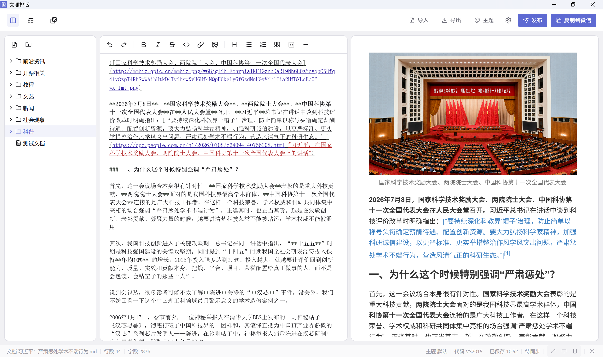

# 文澜排版 VellumStyle

<p align="center">
  <a href="#一软件覆盖的功能跟随提交实时更新">功能介绍</a>
  ·
  <a href="#二下载与安装">下载与安装</a>
  ·
  <a href="#三开源贡献与二次开发">参与开发</a>
  ·
  <a href="#四star-history">Star 趋势</a>
  ·
  <a href="#五license">开源许可</a>
  ·
  <a href="#六致谢与免责声明">致谢与声明</a>
</p>

本项目是用rust+tauri构建的桌面微信公众号排版工具。本工具排版仅适用于Markdown成稿的稿件，因此使用本软件的朋友一般需要具备一定的Markdown语法基础。当然，道友能看到本文，相信你已经来到了Github，故不会Markdown当是我多虑了。




## 一、软件覆盖的功能（跟随提交实时更新）

> 1. 部分功能使用公众号平台官方API接口，需要配置AppID、AppSecret和IP地址白名单后才能使用。对于该部分功能，后文将使用标记。
> 2. 部分功能来自逆向微信公众号官方接口，因此需要在软件内扫码登录后才可使用。对于该部分功能，后文将使用标记。

- 基本功能：

   - 实时编辑与预览：①支持基本编辑与预览；②支持文章排版主题的切换与实时预览；③支持快捷语法插入，支持快捷键（模拟Typora）。
   - 外观与配色：①支持亮色/暗色与多套配色方案；②支持设置自定义背景图（毛玻璃模糊效果）与状态栏透明度。
   - 命令面板：通过 `Ctrl+Shift+P` 搜索并执行视图切换、编辑、插入和应用操作，支持键盘选择与执行。
   - 可视化表格编辑：通过微缩网格快速选择行列，可直接编辑单元格、切换对齐方式、增删行列并拖动调整列宽；光标位于已有 Markdown 表格时可以继续编辑。
   - 公式编辑：支持 LaTeX 行内与块级公式、实时预览，以及按类别整理的常用公式和数学符号快捷插入；光标位于已有公式时可以继续编辑。
   - 模板与常用片段：支持保存当前文章或自定义 Markdown 片段，并可按名称和标签搜索、插入光标处或替换全文。

- ⭐”发布“功能⭐：

   - 复制到微信：软件将渲染后的html代码写入剪贴板，使得用户在公众号网页端文章编辑区粘贴后能够保留在软件内看到的样式效果。

   - 发布到草稿箱：用户可以直接在软件内，上传封面图，填写标题、作者，调整评论功能后，调用微信公众号草稿箱接口生成将文章存档到官方草稿箱。封面图片可以用两种方式确定：
     - 从本地上传，图片会上传到公众号永久素材库，然后返回mediaID关联到封面；
     - 从自己公众号永久素材库中选择。

- ⭐图片、音频和视频的上传与插入⭐：

   - 图片
     - ①快捷键：Ctrl+V粘贴，自动上传到永久素材库并返回对应链接。
     - ②快捷语法按钮上传：有若干选项
       - 从电脑本地上传图片
       - 手机扫码上传图片：不仅便捷，且速度非常之快
       - AI生图：调用微信原生**免费** AI 配图能力按提示词生成图片，自动转为永久素材插入；支持对已生成图片二次调整（图生图）与相关图参考。

     - ③从软件`永久素材库管理`功能窗口选择图片插入，这部分支持单张图片插入，多张图片插入和多选作为轮播图片组插入。
     - ④导入Markdown文档时，自动解析、上传和插入图片。


   - 音频：
     - ①私人音频：从`永久素材库`选择插入我们自己上传的音频，比如一段录音啥的，最大单个1GB。
     - ②在线音频：逆向微信官方音乐插入接口，输入歌名或歌手即可搜索 QQ 音乐，点击歌曲直接插入官方音乐卡片
     - 上传：对于上传，软件内嵌官方上传页，用户平时在网页如何操作，在软件内就如何操作
   - 视频：
     - ①私人视频：从`永久素材库`选择插入我们自己上传的视频，最大单个1GB。
     - ②在线视频：逆向微信官方视频号视频插入接口，支持搜索并选择视频号视频，以官方卡片形式插入文章，横竖版比例、封面与选中态均按官方草稿结构输出。
     - 上传：对于上传，软件内嵌官方上传页，用户平时在网页如何操作，在软件内就如何操作

- ⭐表情管理⭐

   - 微信经典微表情：按官方 20×20 行内尺寸插入，作为图片插入

      

   - 搜索表情插入：跟手机上微信聊天时候搜索使用同一个表情库，作为图片插入

- ⭐文章管理与云同步⭐：

   - 文章管理：①树形管理文章，操作与在windows操作无二，支持`新建`、`重命名`、`删除(删除有提醒)`、`拖动文件及文件夹`、`F2重命名`、`右键可选择复制绝对路径`，以及`右键菜单在系统文件管理器中打开文件位置`；②借鉴VSCode，文件夹悬停浮现`新建文档`、`新建文件夹`两个按钮。③文章默认存储在应用的本地数据目录。
   - 本地版本历史：文章保存时自动保留历史版本，支持逐行查看与当前正文的差异并恢复旧版本；文章或文件夹移动、重命名后，历史记录会随之迁移。
   - 云同步：支持`坚果云WebDAV`免费同步。为了避免频繁触发同步导致上游限流，本工具的上传自动触发周期为3分钟，如果需要立即上传，可以按住Ctrl+S。

- ⭐主题系统⭐：

   - 内置主题：软件内置了 40+ 的排版主题和 250+ Highlight.js/Base16 的代码主题，支持搜索、分页、收藏和置顶。
   - 自定义主题：主题统一为 **CSS 文件**（`.css`），直接写样式，自动作用到 `#article`；放入主题文件夹后自动与内置主题合并。详见 [用户主题制作指南](docs/用户主题制作指南.md)。

- ⭐应用自动更新⭐：软件启动的时候会自动检查新版本，也可以在“设置“对话框的"关于"页面中进行手动检查。发现更新后可以查看版本号和更新内容，并在应用内直接下载安装；安装完成后软件会自动重启。

- ⭐ Markdown文章导入⭐：

   - 批量导入：可以一次选择多个 Markdown 文件，并将其导入当前选中的文档目录。
   - 指定资源目录：有的markdown编辑器对语法进行了扩展，比如Obsidian使用 `![[图片名字]]`这种语法，在自动尝试在子目录查找资源失败后，可以根据指定资源目录进行精准定位，然后解析上传。

- ⭐大图自动压缩⭐：微信永久素材库上传图片限制为 10 × 1024 × 1024 字节（约 10 MiB），本工具支持在图片正式上传前通过内置算法将大于 10 MiB、小于 50 MiB 的图片以秒级速度压缩到 10 MiB 以内，并尽量保持图片质量。

- ⭐永久素材库管理⭐：上传、插入和删除`图片`、`音频`、`视频`。

- 其他”也许“对你来说实用的小功能：

  - 编辑体验：①自动保存与启动恢复；②编辑器和预览器实现了双向高精度同步滚动；③编辑器支持通过 Ctrl+H 打开中文搜索替换面板，可以查找、逐项替换或全部替换当前文档内容；④编辑器与渲染器的比例可调整，并可以在双击分隔条后恢复55开比例；⑤文档目录和大纲导航都能独立调整宽度，同时展开时拖拽条位于相邻卡片之间；⑥连续输入时预览会兼顾防抖和及时刷新，不会因持续输入而长期停滞。

- 文档导入与处理：①Markdown文档上传时，所有图片嵌入都将自动统一为``标签语法；②旧语法``（含标准``）继续兼容解析，无需改写存量文档；③支持SVG图像渲染；④支持数学公式渲染；⑤文中`[xxx](xxx)`超链接语法会被渲染为文章尾注；带中文的url粘贴后产生百分号编码（如 `%E2%80%9C…`）的，渲染自动解码还原为中文。⑥支持 PNG 长图、独立 HTML、A4 PDF、Markdown 原文导出；⑦预览区支持“放开展示”“微信桌面端渲染”和“手机端渲染”三种宽度模式，可以在发布前检查文章在桌面端与移动端的实际排版效果；⑧预览区图片，可以拖动四角缩放手柄调整图片缩放比例。


## 二、下载与安装

仓库已经发布了正式版本，第一次需要从 [GitHub Releases](https://github.com/CaipingPeng/VellumStyle/releases/latest) 下载系统对应的安装包。

推送版本标签后，GitHub Actions 会自动构建并上传各平台安装包：

| 平台 | 构建产物 |
| --- | --- |
| Windows x64 | `MSI`、`NSIS` 安装包 |
| macOS Universal | `DMG`，同时支持 Intel 与 Apple Silicon |
| Linux x64 | `DEB`、`AppImage` |

macOS 安装包由 GitHub Actions 构建；在项目尚未配置 Apple Developer 签名与公证前，macOS 可能提示开发者身份无法验证。
在 Actions 页面手动运行 `Release` 工作流时只生成临时构建产物，不会创建或覆盖正式 Release。

软件安装后，详细的配置见[VellumStyle-文澜排版帮助文档](https://my.feishu.cn/docx/RUDpd1zWnoWuuyx0uFxcahIGnmC)

## 三、开源贡献与二次开发

>  欢迎提交 Issue、主题样式、文档改进和 PR。
>
> **二次开发合规要求（请务必阅读）**
>
> 本项目部分功能（手机传图、AI 配图、表情搜索、QQ 音乐与视频号插入、素材库上传与音频绑定等）基于对微信公众号官方接口的逆向分析构造请求实现，仅支持「人工操作、单篇编辑、个人正常使用」的场景。任何 fork、修改或基于本项目的二次开发，都必须遵守以下红线：
>
> - 禁止改造为批量操作：不得面向微信平台进行批量发文、批量上传、批量插入、批量同步、群发等规模化操作；
> - 禁止自动化操作：不得脱离人工操作流程，以脚本化、无人值守方式自动执行发布、上传、搜索、抓取等平台操作；
> - 禁止破解接口：不得绕过、篡改或攻击微信官方接口的鉴权、加密、风控与权限限制，不得伪造请求或规避官方限制；
> - 禁止用于任何违反微信公众平台相关协议、运营规范或适用法律法规的场景；
> - 就本项目当前功能而言，均在人工操作流程内调用平台既有能力，不涉及批量、破解或绕过，应无法律风险；但任何偏离上述限制的改造与使用，相关账号风险与法律责任由实施者自行承担，本项目及维护者概不负责。

环境要求：

- Node.js 20 或更高版本
- npm 10 或更高版本
- Rust 1.77.2 或更高版本
- Windows 桌面构建需要 WebView2 Runtime 和 Microsoft C++ Build Tools
- macOS / Linux 需要安装 [Tauri v2 对应的系统依赖](https://v2.tauri.app/start/prerequisites/)

安装依赖并启动完整桌面开发环境：

```bash
npm install
npm run tauri
```

如果只调试编辑器、预览和主题等前端功能，可以运行：

```bash
npm run dev
```

Web 模式不包含 Tauri 后端，因此文件选择、图片上传、草稿箱发布、本地文档树、PDF 导出和坚果云同步等功能不可用。

提交前请完成基础检查：

```bash
npm test
npm run build
cargo test --manifest-path src-tauri/Cargo.toml
```

提交问题时请说明操作系统、复现步骤、预期结果和相关报错。日志或截图中的 AppSecret、坚果云授权密码及未发布文章内容请先脱敏。

## 四、Star History

<p align="center">
  <a href="https://star-history.com/#CaipingPeng/VellumStyle&Date">
    
  </a>
</p>

## 五、License

[MIT](./LICENSE) © pengcaiping

## 六、致谢与免责声明

参考项目：

- [markdown-nice](https://github.com/mdnice/markdown-nice)：本项目的产品逻辑、渲染管线和排版思路参考了该项目，并基于 MIT License 做了学习和重写。
- [doocs/md](https://github.com/doocs/md)：命令组织、表格与公式编辑、模板片段和本地版本历史等功能参考了该项目的产品与交互思路，并结合本项目的桌面端架构重新实现；该项目采用 WTFPL v2 许可。

感谢以上开源项目及其贡献者。

`src/themes/builtin/` 中部分主题样式由 mdnice 在线服务的主题模型转换而来（原始 JSON 已删除，可从 git 历史找回），并非全部来自其开源仓库。该部分保留在项目中主要用于学习、个人使用和技术验证，不构成对第三方版权归属的主张。

此外，本项目的完成，离不开 LinuxDO 社区的支持，本开源项目已链接并认可 [LINUX DO 社区](https://linux.do/)。

如果你认为本仓库中的任何内容侵犯了你的版权或其他合法权益，请提供权利证明、作品链接和需要处理的文件范围。维护者会在核实后及时删除、替换或调整相关内容。

同时再次声明：本软件部分功能基于对微信官方接口的逆向分析实现，二次开发必须遵守上文「二次开发合规要求」，禁止改造为批量操作、自动化操作或破解接口等用途，由此产生的任何风险由实施者自行承担。
