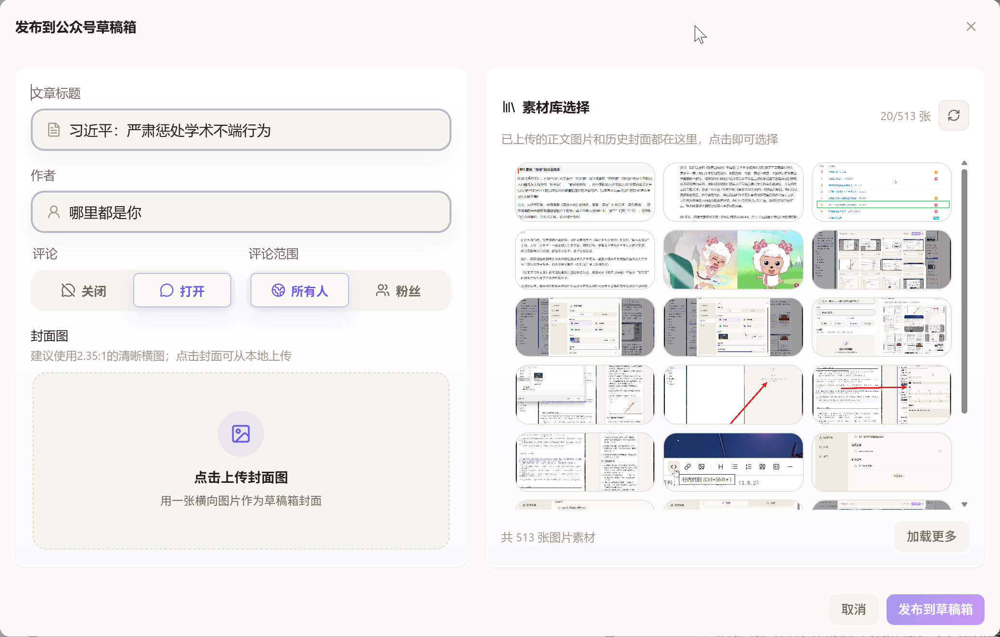
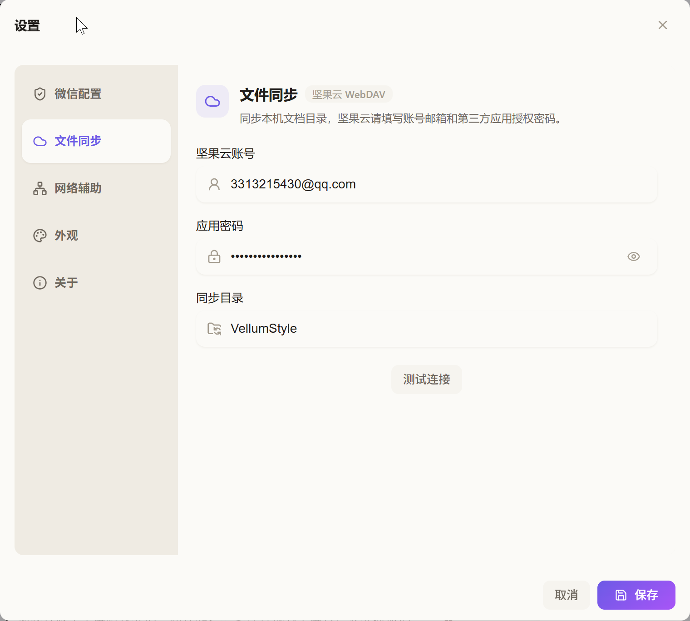
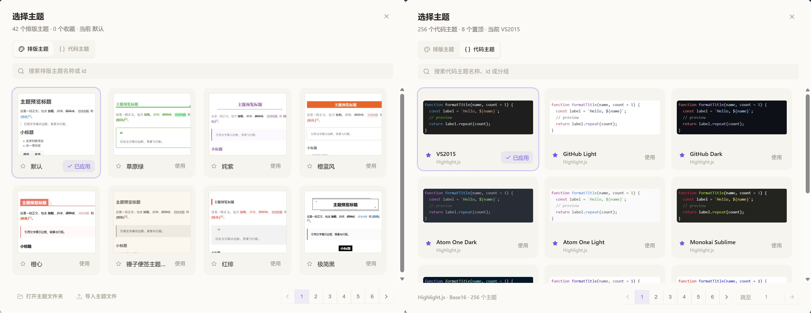
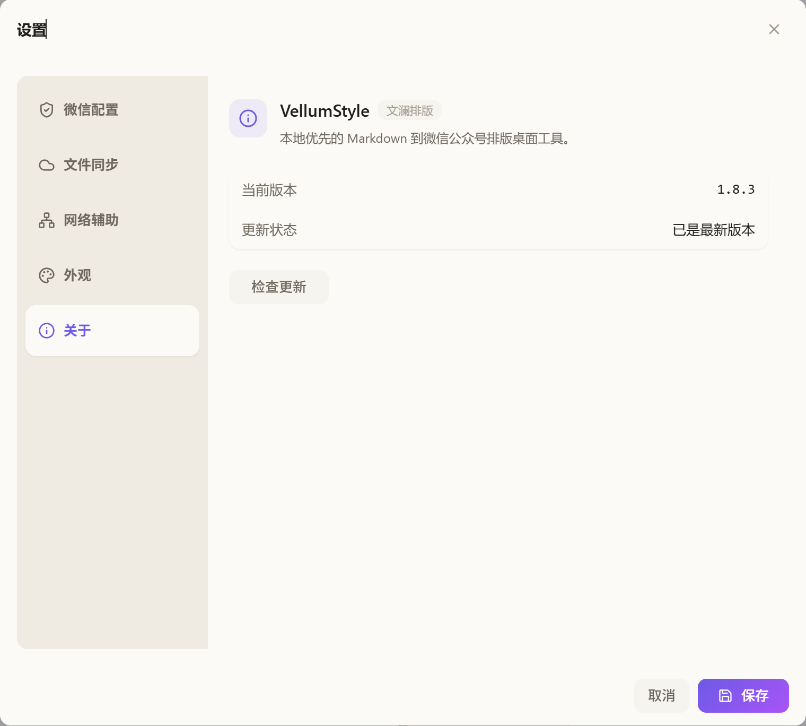
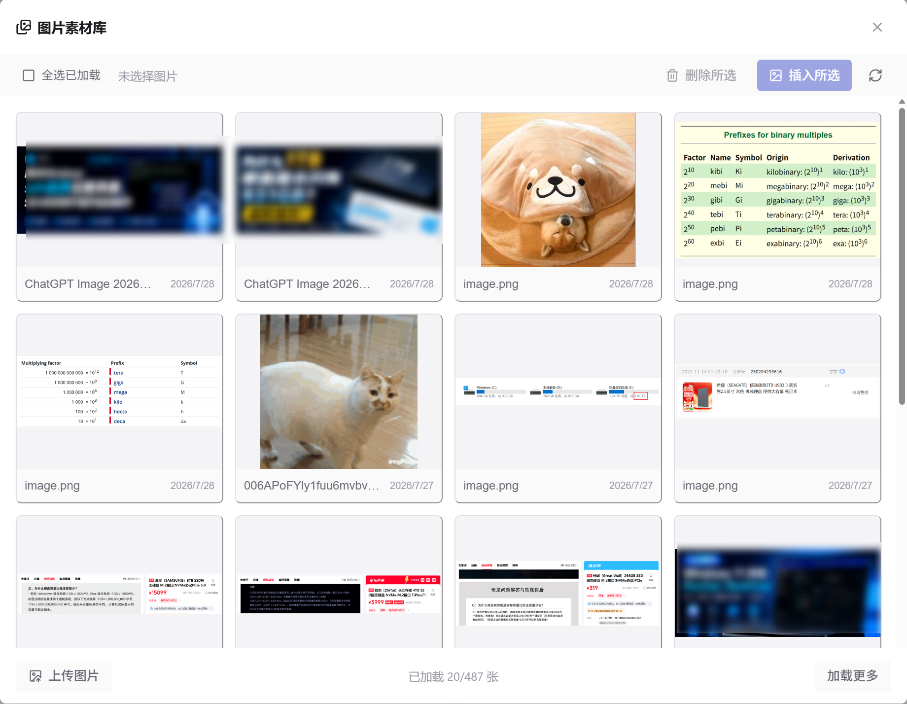
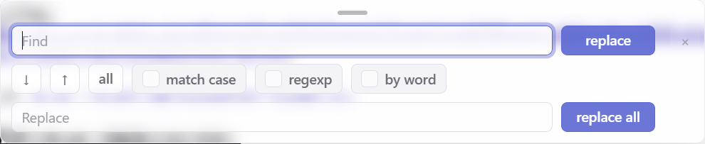
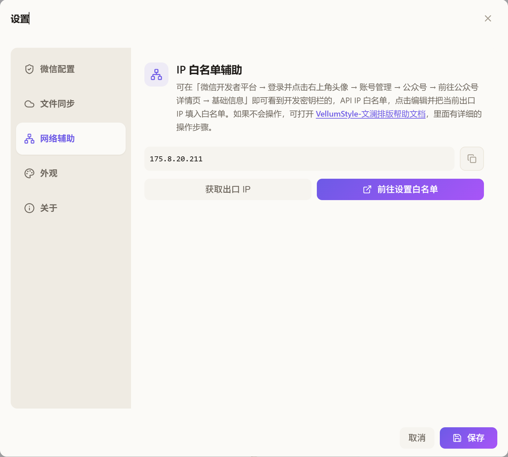

# 文澜排版 VellumStyle

<p align="center">
  <a href="#一软件覆盖的功能跟随提交实时更新">功能介绍</a>
  ·
  <a href="#二下载与安装">下载与安装</a>
  ·
  <a href="#三开源贡献与二次开发">参与开发</a>
  ·
  <a href="#四star-history">Star 趋势</a>
  ·
  <a href="#五license">开源许可</a>
  ·
  <a href="#六致谢与免责声明">致谢与声明</a>
</p>

本项目是用rust+tauri构建的桌面微信公众号排版工具。本工具排版仅适用于Markdown成稿的稿件，因此使用本软件的朋友一般需要具备一定的Markdown语法基础。当然，道友能看到本文，相信你已经来到了Github，故不会Markdown当是我多虑了。


## 一、软件覆盖的功能（跟随提交实时更新）

1. 基本功能：

   - 实时编辑与预览：左侧编辑Markdown，右侧根据**选定的主题**实时渲染排版效果。编辑器支持部分常用Markdown语法占位符的快速插入，已经全面支持快捷键，快捷键按照Typora的组合来制作的。
   - 外观与配色：界面采用暖纸底色与靛紫渐变强调色，可在「设置 → 外观」中切换亮色/暗色模式，并选择文澜紫、珊瑚暖橙、薄荷青绿、海岸蓝四套配色方案；还支持设置自定义背景图（毛玻璃模糊效果）与状态栏透明度。

2. ⭐”发布“功能⭐：

   - 复制到微信：软件将渲染后的html代码写入剪贴板，使得用户在公众号网页端文章编辑区粘贴后能够保留在软件内看到的样式效果。

   - 发布到草稿箱：用户可以直接在软件内，上传封面图，填写标题、作者，调整评论功能后，调用微信公众号草稿箱接口生成将文章放到微信公众号平台的草稿箱，非常方便。

     封面图片可以用两种方式确定：①从本地上传，图片会上传到公众号永久素材库，然后返回mediaID；②直接用自己公众号永久素材库选择，如果需要用你已经上传过的图片，那么这一种方式将会非常方便。

     

3. ⭐图床与图片上传⭐：

   软件目前支持四种图片处理方式，①Ctrl+V粘贴；②通过快捷语法按钮上传本地图片；③通过快捷语法按钮**复用永久素材库的图片**；④导入Markdown文档时，自动解析并处理原始图片。不管是哪一种，最终图片都会经软件调用后端上传服务，上传到自己公众号的永久素材库。

   图片上传后，文章图片的地址会被替换为微信永久素材库的官方链接。此般，解决了图床跑路导致文章图片失效的问题。

4. ⭐文章管理与云同步⭐：

   - 文章管理：在本地用户目录，针对本软件会创建一个目录用于存档用户的文章。如下图左图所示，文章是树形管理的，也就是说你可以像在使用windows文件管理一样在软件内`新建`、`重命名`、`删除`、`拖动文件及文件夹`，也可以通过`右键菜单在系统文件管理器中打开文件位置`或者 直接复制`绝对路径`。删除非空的文件夹前会提示将被递归删除的项目（文件/文件夹）数量，降低误操作的风险。文档侧栏宽度可以自由拖动调整；打开深层文档时，软件会自动展开其所在目录。

        

   - 云同步：为了满足多设备的使用，软件使用坚果云免费的 WebDAV服务，把文件管理目录下的文件树同步到云端目录。在另一台设备上安装本软件后，配置好坚果云账号信息，即可恢复A设备的所有文章。为了避免频繁触发同步导致上游限流，本工具的上传自动触发周期为3分钟，如果需要立即上传，可以按住Ctrl+S。

   - 本地优先：文章编辑和保存不依赖于网络，云同步在本地保存完成后于后台异步执行，不会因为网络波动阻塞正常编辑。

5. ⭐主题系统⭐：

   软件内置了 40+ 的排版主题和 250+ Highlight.js/Base16 的代码主题，支持搜索、分页、收藏和置顶。

   

   - 自定义主题：本软件的主题文件本质上是用json写的，然后写了一套对应的解析器解析到css，用户如果有相关能力，可以自己定义新主题；用户自定义的主题会与内置主题自动合并。

6. ⭐应用自动更新⭐：软件启动的时候会自动检查新版本，也可以在“设置“对话框的"关于"页面中进行手动检查。发现更新后可以查看版本号和更新内容，并在应用内直接下载安装；安装完成后软件会自动重启。这个功能极大提高了用户体验，版本更新无需用户再去下载安装包。

   

7. ⭐ 批量 Markdown 导入与资源根目录⭐：

   - 批量导入：可以一次选择多个 Markdown 文件，并将其导入当前选中的文档目录。
   - 指定资源目录：有的markdown编辑器对语法进行了扩展，比如Obsidian使用 `![[图片名字]]`这种语法，在自动尝试在子目录查找资源失败后，可以根据指定资源目录进行精准定位，然后解析上传。

8. ⭐大图自动压缩⭐：微信永久素材库上传图片限制为 10 × 1024 × 1024 字节（约 10 MiB），本工具支持在图片正式上传前通过内置算法将大于 10 MiB、小于 50 MiB 的图片在秒级时间内压缩到 10 MiB 以内，并尽量保持图片质量。

9. ⭐永久素材库管理⭐：有时候可能错误上传了一些图片，亦或者对图片版本有更新，那么旧版本自然作废，于是就有了删除的需求。如果每次都去公众号网页端管理素材库在我看来很是麻烦，于是就把这部分功能集成到工具内了。

   如下图所示，该板块现在支持批量选择与删除、批量选择与插入、直接上传图片到素材库而不插入文章，也支持将多选图片一键插入为可左右滑动的横滑图片组。

   

10. 其他”也许“对你来说实用的小功能：

   - 编辑体验

     - 自动保存与启动恢复：编辑内容会自动保存为本地的Markdown 文件，切换文档或关闭窗口前也会主动刷新尚未落盘的内容。软件会记住上次打开的文档，下次启动时自动恢复编辑现场。

     - 同步滚动：编辑器和预览器实现了双向高精度同步滚动。

     - 搜索与替换：编辑器支持通过 Ctrl+H 打开中文搜索替换面板，可以查找、逐项替换或全部替换当前文档内容。

       

     - 比例调整：编辑器与渲染器的比例可调整，并可以在双击分隔条后恢复55开比例。

     - 大纲导航：文档如果有标题语法，即 `# xxx`、 `## xxx`这种，左侧有可折叠导航栏，展开后可依据多级标题形成目录导航，方便长文定位。

   - 文档导入与处理

     - Markdown文档导入：该功能区别于其他的编辑器逻辑——只上传文本，不做后处理，本软件上传过程中会单独处理所有的图片语法，不论你使用的是Obsidian的"**![[]]**"语法，还是``的html标签语法，最终都会在图片上传后统一到``这样的Markdown图片插入标准语法。

       软件为了保留文档在其他编辑器编辑时留下的图片缩放等额外参数，对标准语法进行了轻度扩展，原始缩放会转换到``语法。

     - 扩展语法解析支持：①支持Mermaid代码直接渲染为SVG图形，并确保粘贴/发布到草稿箱后能保留SVG图形；②支持标准的 `$行内公式$`和`$$行间公式$$`数学公式渲染；③支持”参考文献“功能，文章如果使用了 `[xxx](url "title")`超链接语法，渲染为 $\lceil \text{xxx}\rfloor ^{[\text{文献序号}]}$这种样式，并自动在文末插入一条 $[\text{文献序号}]\space \text{title：url}$​​这样的文献；④支持横滑图片组：用尖括号包裹多张图片（`<,>`）即可渲染为可左右滑动的轮播图组，一次滑动翻一页、松手自动对齐，最多 10 张；也可以在图片素材库中多选图片后一键插入。

     - 脚注链接可读化：文章链接发布到微信后会渲染为文末脚注（微信会过滤外链），脚注中的 URL 会自动做百分号解码——浏览器复制链接时产生的编码中文（如 `%E2%80%9C…`）会还原为中文原文，读者看到的是可读链接而不是一长串乱码。
     - 文档导出：支持 PNG 长图、独立 HTML、A4 PDF、Markdown 原文导出。

   - 预览体验

     - 多终端预览：预览区支持“放开展示”“微信桌面端渲染”和“手机端渲染”三种宽度模式，可以在发布前检查文章在桌面端与移动端的实际排版效果。

     - 可视化图片缩放：在预览区选中图片后，可以拖动四角缩放手柄调整图片宽度。缩放过程保持原始比例并实时显示宽度百分比，调整的结果会自动写回 Markdown 的图片尺寸扩展语法。

     - 可视化样式编辑：可以直接在预览区单击选中标题、段落、列表、引用、图片等文章元素，在样式面板中调整字号、颜色、背景、行高、字间距、对齐方式、间距、边框和圆角等属性。样式修改分为“临时修改”和“永久修改”两种模式，临时修改只影响当前预览；永久修改会写入用户主题文件，并在后续文档及下次启动时继续生效。

   - 其他

     - 微信接口白名单助手：如下图右边分图，可以在设置中一键获取并复制当前的出口公网 IP，同时跳转到微信开发者平台的 IP 白名单配置页面。软件启动时也会检测出口 IP 是否发生变化，变化后展示新旧 IP 并主动提醒更新白名单，如下图左图所示，减少因为动态公网 IP 导致的接口调用失败。

       

## 二、下载与安装

仓库已经发布了正式版本，第一次需要从 [GitHub Releases](https://github.com/CaipingPeng/VellumStyle/releases/latest) 下载系统对应的安装包。

推送版本标签后，GitHub Actions 会自动构建并上传各平台安装包：

| 平台 | 构建产物 |
| --- | --- |
| Windows x64 | `MSI`、`NSIS` 安装包 |
| macOS Universal | `DMG`，同时支持 Intel 与 Apple Silicon |
| Linux x64 | `DEB`、`AppImage` |

macOS 安装包由 GitHub Actions 构建；在项目尚未配置 Apple Developer 签名与公证前，macOS 可能提示开发者身份无法验证。
在 Actions 页面手动运行 `Release` 工作流时只生成临时构建产物，不会创建或覆盖正式 Release。

软件安装后，详细的配置见[VellumStyle-文澜排版帮助文档](https://my.feishu.cn/docx/RUDpd1zWnoWuuyx0uFxcahIGnmC)

## 三、开源贡献与二次开发

>  欢迎提交 Issue、主题样式、文档改进和 PR。

环境要求：

- Node.js 20 或更高版本
- npm 10 或更高版本
- Rust 1.77.2 或更高版本
- Windows 桌面构建需要 WebView2 Runtime 和 Microsoft C++ Build Tools
- macOS / Linux 需要安装 [Tauri v2 对应的系统依赖](https://v2.tauri.app/start/prerequisites/)

安装依赖并启动完整桌面开发环境：

```bash
npm install
npm run tauri
```

如果只调试编辑器、预览和主题等前端功能，可以运行：

```bash
npm run dev
```

Web 模式不包含 Tauri 后端，因此文件选择、图片上传、草稿箱发布、本地文档树、PDF 导出和坚果云同步等功能不可用。

提交前请完成基础检查：

```bash
npm test
npm run build
cargo test --manifest-path src-tauri/Cargo.toml
```

提交问题时请说明操作系统、复现步骤、预期结果和相关报错。日志或截图中的 AppSecret、坚果云授权密码及未发布文章内容请先脱敏。

## 四、Star History

<p align="center">
  <a href="https://star-history.com/#CaipingPeng/VellumStyle&Date">
    
  </a>
</p>

## 五、License

[MIT](./LICENSE) © pengcaiping

## 六、致谢与免责声明

本项目的产品逻辑、渲染管线和排版思路参考了 mdnice 的开源项目 [markdown-nice](https://github.com/mdnice/markdown-nice)，并基于 MIT License 做了学习和重写，特此致谢。

`src/themes/presets/` 中部分主题样式参考自 mdnice 在线服务，并非全部来自其开源仓库。该部分保留在项目中主要用于学习、个人使用和技术验证，不构成对第三方版权归属的主张。

此外，本项目的完成，离不开 LinuxDO 社区的支持，本开源项目已链接并认可 [LINUX DO 社区](https://linux.do/)。

如果你认为本仓库中的任何内容侵犯了你的版权或其他合法权益，请提供权利证明、作品链接和需要处理的文件范围。维护者会在核实后及时删除、替换或调整相关内容。
