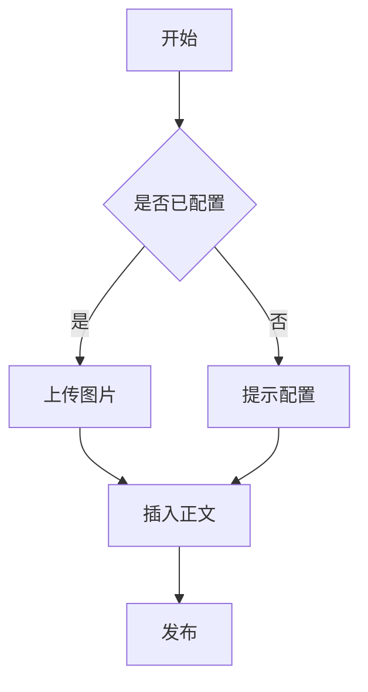

# VellumStyle 主题压测文章 v2

用途：压测主题对全部元素的覆盖与极限场景表现。图片均为占位符（`https://placehold.co/...`），可全局搜索替换。文末附占位符清单与测试项检查表。

用法：把本文导入应用 → 切换要压测的主题 → 按 `T01`~`T20` 逐项核对 → 按编号反馈（如"T11 失败：第八列被裁切"）。

[toc]

---

## T01 · 标题层级（h1~h6 与标题装饰）

> 检查：h1（本文标题）/ h2（各测试项标题）的装饰；h3~h6 字号、颜色逐级变化；超长标题换行正常；手动编号徽章（.prefix）是否显示。

### 三级标题（h3）

#### 四级标题（h4）

##### 五级标题（h5）

###### 六级标题（h6）

## <span class="prefix">T01</span> 手动编号徽章（h2 的 .prefix 装饰）

### 带行内格式的标题：`代码`、**加粗**、*斜体*、==高亮==

**超长标题：** 这是一段非常非常长的二级标题，用来测试标题文字过长时的换行、行高与下划线装饰是否正常，以及 .content 与装饰元素在换行场景下是否错位。

---

## T02 · 正文与行内格式

> 检查：段落间距与两端对齐；加粗 / 斜体 / 删除线 / 高亮 / 行内代码；注音小字；中英混排的字体切换。

这是一段中文正文，用来测试段落间距、行高与两端对齐。墨色的排版讲究留白与呼吸感，正文应该在阅读时保持舒适的行距，段落之间留有清晰但不过度的间隔。中英混排也很常见，比如 VellumStyle 与 Markdown 一起出现，字体栈要能优雅地处理 PingFang、Microsoft YaHei 与 Consolas 的切换。

行内格式：**加粗文字**、*斜体文字*、~~删除线文字~~、`行内代码`、==荧光高亮==、{注音|zhù yīn}、{汉字|hàn zì}。

多语言混排：中文 Chinese English 日本語 한국어 Español Français Deutsch，测试行高与基线对齐。

---

## T03 · 断行与特殊字符极限

> 检查：无空格超长英文串与超长 URL 不溢出容器（overflow-wrap）；实体写法在正文渲染为 `& < > "`；行内代码里特殊字符原样；Emoji 正常显示。

- **无空格超长英文串**：SupercalifragilisticexpialidociousSupercalifragilisticexpialidociousSupercalifragilisticexpialidociousSupercalifragilisticexpialidocious
- **无空格中文长串**：这是没有空格的中文超长段落这是没有空格的中文超长段落这是没有空格的中文超长段落这是没有空格的中文超长段落
- **超长 URL**：<https://example.com/very/long/path/with/many/segments?query=one&query=two&query=three&query=four#fragment>
- **特殊字符**：`< > & " '`（行内代码里原样显示）；实体写法 &amp; &lt; &gt; &quot;（正文里应渲染为 `& < > "`）
- **符号与表情**：箭头 → ← ↑ ↓、数学符号 ± × ÷ ≤ ≥ ≠、Emoji：😀 😅 🎉 🚀 ❤️ ✅ 📌 🐱 🍉 🌙

---

## T04 · 列表（含嵌套与宽松列表）

> 检查：无序/有序列表符号与缩进；嵌套 3~4 层时符号逐层变化；宽松列表（多段落项）间距；列表内嵌代码块。

- 一级无序项 A
- 一级无序项 B
  - 二级无序项 B1
    - 三级无序项 B1a
      - 四级无序项 B1a1
  - 二级无序项 B2

1. 第一项
2. 第二项
   1. 嵌套有序 2.1
   2. 嵌套有序 2.2
      1. 再嵌套 2.2.1
3. 第三项

- 宽松列表第一段：用来测试列表项内的段落间距。

  宽松列表续段：空行后的内容应保持列表缩进并正常断行。

- 列表项内嵌代码块：

  ```ts
  const nested = "list + code";
  ```

---

## T05 · 定义列表

> 检查：`<dl><dt><dd>` 的排版（术语加粗、定义缩进与换行）。

> 语法：`术语` 独占一行，下一行以 `: ` 开头写定义，可连续多组。

术语一
: 定义一的内容，用来测试 dl/dt/dd 的排版。

术语二（长定义）
: 这是一段比较长的定义内容，用来测试 dd 的换行与缩进表现，同时测试定义列表与正文之间是否保持合理的间距与分隔。

---

## T06 · 引用块（单层与嵌套分层）

> 检查：单层引用的边框、底色、大引号装饰；嵌套 2~3 层时结构选择器是否分层变色；引用内嵌列表与代码的缩进。

> 单层引用内容，引用里可以有 `行内代码` 和 **加粗**。

> 第一层引用内容，用来测试外层的底色与边框。
>
> > 第二层引用内容，嵌套层级应通过结构选择器呈现不同的配色或边框。
>
> > > 第三层（最深嵌套，压测三层配色）。

> 引用里可以嵌套列表：
>
> - 引用内的无序项
> - 引用内的二级嵌套
>   - 更深一层
>
> 引用里也可以有代码块：
>
> ```python
> def inside_quote():
>     return "quote + code"
> ```

---

## T07 · 代码块（多语言与常规形态）

> 检查：`pre.custom` 容器（圆角/边框/阴影/顶部装饰条）；不同语言高亮；无语言与波浪线围栏；空行不丢。

```ts
interface Theme {
  name: string;
  css: string;
}

const themes: Theme[] = [{name: "墨岚", css: "#article { color: #38342c; }"}];
```

```python
def fibonacci(n: int) -> int:
    if n <= 1:
        return n
    return fibonacci(n - 1) + fibonacci(n - 2)
```

```json
{
  "theme": "墨岚",
  "palette": {"paper": "#faf7f0", "ink": "#38342c", "accent": "#3f5d7a", "gold": "#a87b3f"}
}
```

```
plain text block
第二行
```

~~~text
tilde fence content
~~~

```ts
const empty = "";


const afterBlankLines = 1;
```

---

## T08 · 代码块极限（超长行横向滚动）

> 检查：超过容器宽度的单行代码应横向滚动而不是换行或撑破布局。

```text
这是一行非常非常长的代码内容用来压测横向滚动，超过容器宽度时应该出现横向滚动而不是换行撑破布局：xxxxxxxxxxxxxxxxxxxxxxxxxxxxxxxxxxxxxxxxxxxxxxxxxxxxxxxxxxxxxxxxxxxxxxxxxxxxxxxxxxxxxxxxxxxxxxxxxxxxxxxxxxxxxxxxxxxxxxxxxxxxxxxxxxxxxxxxxxxxxxxxxxxxxxxxxxxxxxxxxxxxxxxxxxxxxxxxxxxxxxxx
```

---

## T09 · Mermaid 流程图

> 检查：流程图居中、svg 不超过容器宽度、节点文字清晰。



---

## T10 · 表格（常规形态）

> 检查：表头渐变/圆角；单元格内边距与换行；隔行斑马纹；首列强调；表头内嵌行内样式。

| 项目 | 状态 | 说明 |
| --- | --- | --- |
| 标题 | ✅ | h1~h6 全部覆盖 |
| 引用 | ✅ | 单层/双层/三层 |
| 代码 | ✅ | 多语言 + 超长行 |

| 描述 | 示例 |
| --- | --- |
| 行内代码 | `npm run dev` |
| 加粗与链接 | **加粗** 与 [链接](https://example.com/table) |
| 长文本 | 这是一段用于压测单元格内长文本换行的内容，需要正确换行并保持单元格对齐，同时不撑破表格布局。 |

| **加粗表头** | *斜体表头* | `代码表头` |
| --- | --- | --- |
| A | B | C |

---

## T11 · 表格极限（宽表滚动与单元格图片）

> 检查：八列宽表应横向滚动、第八列完整可见；单元格内图片不溢出且与同行文字垂直对齐。

| 第一列（较长表头） | 第二列 | 第三列 | 第四列 | 第五列 | 第六列 | 第七列 | 第八列 |
| --- | --- | --- | --- | --- | --- | --- | --- |
| 单元格内容 A | B | C | D | E | F | G | H |
| 一个比较长的单元格内容，用来压测单元格内换行 | 短 | 中 | 较长内容 | 短 | 中 | 较长内容 | 短 |
| 图片 |  | 图片 | 文字 | 图片 | 文字 | 图片 | 文字 |

---

## T12 · 图片（独立图、尺寸语法与图注）

> 检查：独立图片包 figure、图注居中显示（文字来自 alt）；`=200x120` 固定尺寸、`=40%x` 百分比、title 属性；长图注换行；多图连排间距。


---

## T13 · 行内图片与原始 img

> 检查：行内图片与文字基线对齐、不换行；独立成段的原始 `` 标签同样被包成 figure 且有图注。

这段话里嵌了一张行内图片 ，用来测试行内图片与文字基线对齐、以及主题里 `p img` 的样式是否正确。


---

## T14 · 横滑图组（新旧语法）

> 检查：新语法（逗号分隔 img）与旧语法（`<,>`）都渲染为可左右滑动的图组；提示文字样式正确；组内图片不出现拖拽缩放框。

新语法：

,,

旧语法：

<,>

---

## T15 · 链接与脚注

> 检查：Markdown 链接渲染为脚注引用（`.footnote-word` + `.footnote-ref`）；带标题/引用式链接正常；标准脚注标记 `[^n]`；脚注区多条目排版；脚注内容里的链接会变成嵌套脚注引用（预期行为）。

[VellumStyle 项目地址](https://github.com/CaipingPeng/VellumStyle) 与 [另一个链接](https://example.com/another)。

[带标题链接](https://example.com/titled "这是链接标题") 与 [引用式链接][ref-link]

[ref-link]: https://example.com/reference "引用链接标题"

正文里插入脚注标记[^一][^二]和[^三]，用于测试 `sup.footnote-ref` 的样式。

[^一]: 第一个脚注，纯文本。
[^二]: 第二个脚注，包含 **加粗**、*斜体*、`代码` 和 [链接](https://example.com/fn2)。
[^三]: 第三个脚注，包含[^四]嵌套脚注引用，压测脚注套脚注。

[^四]: 被嵌套的脚注。

---

## T16 · 数学公式

> 检查：行内公式与块级公式的字号、居中、浅底卡片样式（MathJax 运行时排版）。

行内公式：$E=mc^2$，以及带分数的 $\frac{a}{b}$ 与 $\sum_{i=1}^{n} i = \frac{n(n+1)}{2}$。

块级公式：

$$ x = \frac{-b \pm \sqrt{b^2 - 4ac}}{2a} $$

$$ \int_0^\infty e^{-x^2} dx = \frac{\sqrt{\pi}}{2} $$

---

## T17 · 分隔线

> 检查：hr 渐变细线与中央菱形装饰、上下间距。

---

---

## T18 · 目录（TOC）

> 检查：`[toc]` 渲染为目录卡片，层级缩进与链接颜色正常（本页顶部已有一份）。

---

## T19 · 原始 HTML（链接 / 下划线 / iframe / SVG）

> 检查：原始 `<a>` 保持可点击链接（不转脚注）；`<u>` 下划线；iframe 与 SVG 不超过容器宽度。

<a href="https://example.com/raw">原始 <a> 标签链接（不被转成脚注）</a> 与 <u>下划线文本</u>。

<iframe src="https://example.com/embed" width="100%" height="315"></iframe>

<svg viewBox="0 0 100 100" width="120" height="120"><rect x="10" y="10" width="80" height="80" rx="12" fill="#3f5d7a"></rect><circle cx="50" cy="50" r="24" fill="#faf7f0"></circle></svg>

---

## T20 · 组合地狱（嵌套极限）

> 检查：引用套列表套引用套代码时各层缩进与边框不错乱；段落内全格式混排正常。

> 引用套列表套引用套代码：
>
> 1. 有序项
>    - 无序子项
>    - 无序子项
>      > 引用里的引用
>      >
>      > ```js
>      > const deep = "quote > list > quote > code";
>      > ```
> 2. 结尾项

**段落里混排**：加粗里有 `代码` 和 *斜体*，还有 ==高亮== 和 ~~删除线~~，最后跟一个[链接](https://example.com/combo)，以及 $x^2$ 行内公式。

---

## 附 A · 占位符替换清单（测试完删除本段）

所有图片均为占位符，统一使用 `https://placehold.co/` 前缀。替换方式：全局搜索 `占位图` 逐个替换成真实图片（Markdown 写法），或搜索 `https://placehold.co` 替换原始 HTML / 横滑写法；替换后保留 alt 文字；横滑组保持同一行的逗号分隔结构。

| 占位符 | 用途 |
| --- | --- |
| 占位图-表格内 | 表格单元格内图片（T11） |
| 占位图-横版山川 | 独立图注（T12） |
| 占位图-固定尺寸200x120 | 测试 `=200x120` 尺寸语法（T12） |
| 占位图-宽度40% | 测试 `=40%x` 百分比宽度（T12） |
| 占位图-带标题 | 测试 title 属性（T12） |
| 占位图-长图注 | 测试长 figcaption（T12） |
| 占位图-多图1/2/3 | 多图连排（T12） |
| 占位图-行内小图 | 行内图片（T13） |
| 占位图-原始img | 原始 `` 标签（T13） |
| 占位图-横滑1/2/3 | 新语法横滑图组（T14） |
| 占位图-旧横滑1/2 | 旧语法横滑图组（T14） |

## 附 B · 测试项检查表

| 编号 | 测试项 | 检查要点 |
| --- | --- | --- |
| T01 | 标题层级 | h1/h2 装饰；h3~h6 逐级变化；超长标题换行；手动编号徽章 |
| T02 | 正文与行内格式 | 段落间距/两端对齐；加粗/斜体/删除线/高亮/行内代码/注音；多语言混排 |
| T03 | 断行与特殊字符 | 长英文串/URL 不溢出；实体渲染为 `& < > "`；行内代码原样；Emoji |
| T04 | 列表 | 符号/缩进；嵌套 3~4 层；宽松列表；列表内代码 |
| T05 | 定义列表 | dt/dd 排版与换行 |
| T06 | 引用 | 单层边框/引号装饰；嵌套 2~3 层分层；引用内列表与代码 |
| T07 | 代码块常规 | 容器圆角/边框/装饰条；多语言高亮；无语言/tilde；空行 |
| T08 | 代码块极限 | 超长行横向滚动 |
| T09 | Mermaid | 居中；svg 不超宽 |
| T10 | 表格常规 | 表头渐变/圆角；斑马纹；首列；表头内嵌样式 |
| T11 | 表格极限 | 宽表横向滚动、末列完整；单元格图片不溢出且垂直对齐 |
| T12 | 图片 | figure/图注；=WxH/百分比/title；长图注；多图连排 |
| T13 | 行内图与原始 img | 行内图基线对齐；原始 img 独立成段有图注 |
| T14 | 横滑图组 | 新旧语法都渲染为滑动图组；组内无缩放框 |
| T15 | 链接与脚注 | 链接转脚注；带标题/引用式；标准脚注；密集条目；嵌套脚注 |
| T16 | 数学公式 | 行内/块级公式字号、居中、底色 |
| T17 | 分隔线 | hr 渐变线与菱形装饰 |
| T18 | 目录 | [toc] 卡片、层级缩进、链接色 |
| T19 | 原始 HTML | a/u/iframe/svg 正常显示 |
| T20 | 组合地狱 | 多层嵌套不错乱；段内全格式混排 |

反馈格式：`T 编号 + 通过/失败 + 现象`（如 `T11 失败：第八列被裁切`）。
